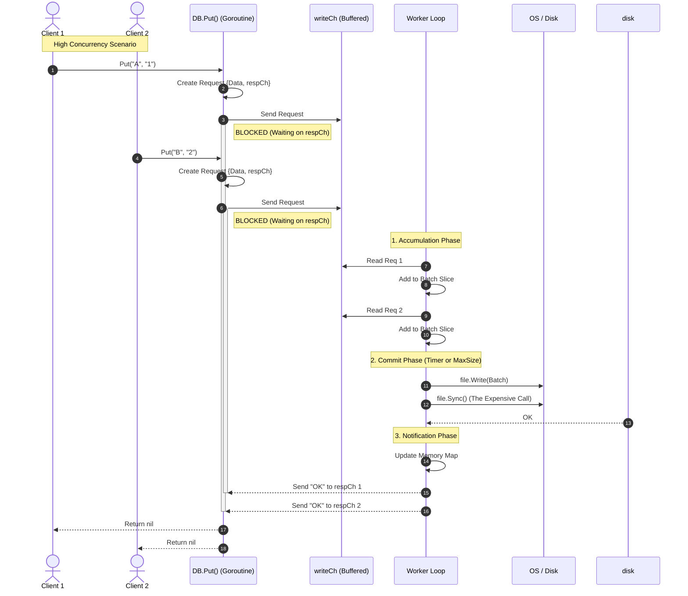
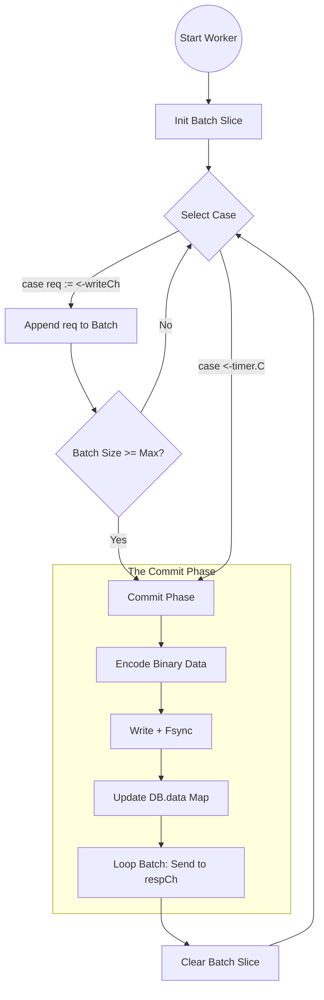
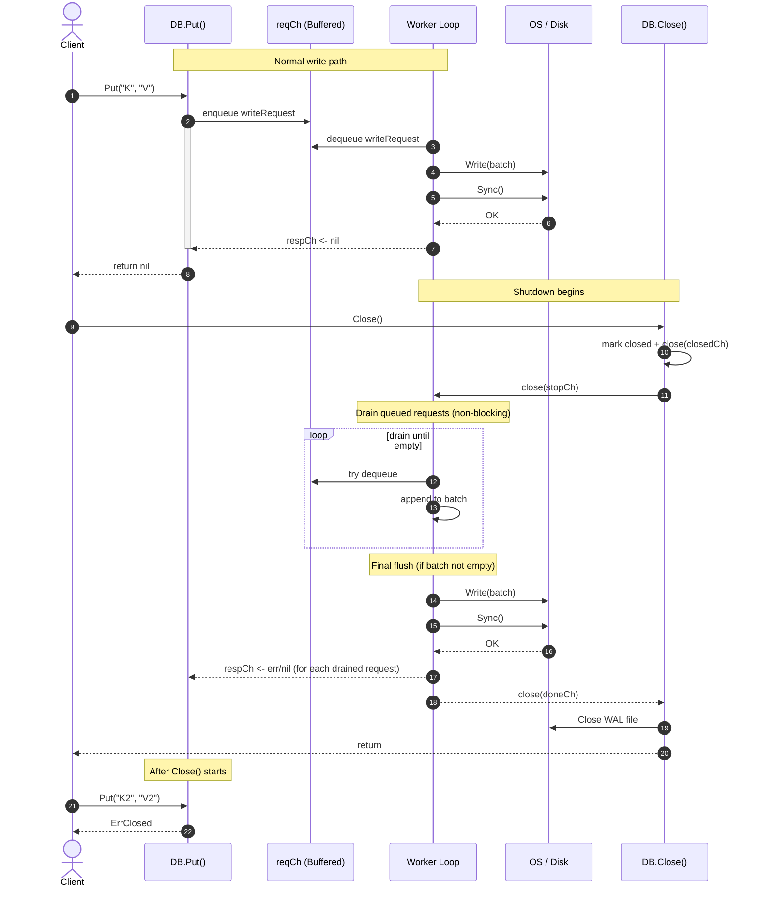
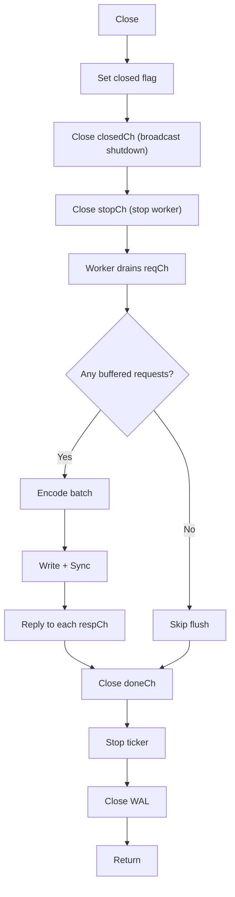

# Sabotage
`file.Sync()` becomes the bottleneck. What policy should I choose to balance durability and throughput?

## Analysis
This reminds me of isolation levels in relational databases: instead of one “correct” setting, systems usually offer a small set of trade-offs.

Once `file.Sync()` dominates the write path, there are two extremes:
`Flush immediately <-----------------------> Let the kernel deal with it`

- Flush immediately: strongest durability, worst latency/throughput.
- Let the kernel deal with it: best performance, but recent writes may be lost on crash or power loss.

Most designs live between these points. I can model it as a few durability levels, or pick a single practical default.
One reasonable middle ground is group commit: flush the buffer periodically (or after N writes).

## What to do
After reading up on common approaches, I’m leaning toward `Strict Group Commit`: no acknowledged writes are lost, while throughput stays reasonable.
It’s also a good exercise for mastering Go’s concurrency toolchain.
Below is a diagram of how `Strict Group Commit` would work in `kvgo`:

## Graceful shutdown
`Strict Group Commit` is only useful if shutdown doesn’t strand callers.
The shutdown goal is: stop accepting new writes, drain any queued writes, flush once, then release resources.

