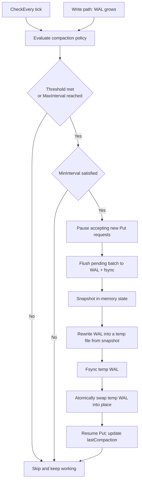

# Sabotage
What if a user writes the same key tens of thousands of times?
It’s time to look beyond memory and deal with the real world: disk.

## What to do
This is clearly wasteful: we write many duplicated keys to the WAL, but only the last value matters.
So log compaction is now on the table.

The simplest approach is snapshotting: the current state already lives in memory, so we can rewrite the log file from that snapshot.
The hard part is correctness under concurrency.

Because the group-commit loop dominates the write path, folding compaction into that loop is the simplest architectural choice.
To avoid the complexity of background compaction (e.g., Redis-style fork/merge), I’ll defer that optimization and start with a “stop-the-world” compaction.

The general flow is: a ticker (or another signal) notifies the worker; the worker flushes any buffered writes; performs compaction; then resumes normal work.
That’s it—and the problem shows up before writing any code: what interval should I pick?
It shouldn’t be an arbitrary value; this is a **policy** decision (e.g., when `db.Compact()` is allowed to run).

## Read up
The common answer is policy-driven: periodic checks + threshold conditions + rate limiting.
The ticker is not compaction by itself; it’s just “how often we check”. Compaction only runs when the policy says it’s worth it.

Here’s a naive first policy for this project:
- CheckEvery: 30m (how often the worker evaluates the policy)
- MinInterval: 30m (at most one compaction per 30 minutes)
- MaxInterval: 24h (optional safety net; bounds recovery time under low traffic)
- Threshold: WAL bytes / live bytes >= 10

Let me draw a diagram to reflect the design:

