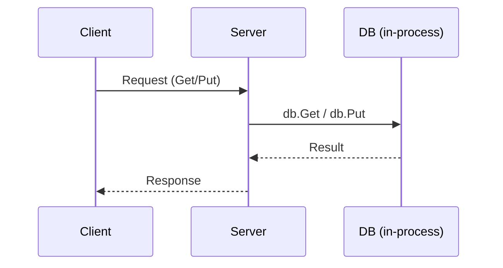

# Sabotage
What breaks if I run two copies of this database?

## Analysis
`DB` takes a file path on startup, so I can start a second copy with a different path or the same one.

- Different path: not *incorrect*, but now I'm running two independent databases competing for CPU, memory, and disk.
  That's mostly a workload and resource-management problem.
- Same path: this is where things break. Two processes operate on the same WAL and on-disk state.
  Without careful cross-process coordination, this quickly leads to corruption or other undefined behavior.

So the better question is: what do I actually want when I say "two copies"?

Usually I don't want *two databases* on the same files — I want *multiple clients* to use the same database.
Instead of turning the storage engine into a multi-process system (file locks, shared log ownership, cross-process
group commit, coordinated compaction, etc.), a simpler and more common design is:

- one process owns the database files and in-memory state
- other processes talk to it over a network/IPC interface

That leads to the next step: introduce a server (a network/IPC layer) as the single owner of the DB,
so multiple clients can use it safely without multiple DB instances sharing one path.

## What to do
Create a single server process that owns the DB and accepts read/write requests from clients.
This lets many clients share one database safely, without multiple processes touching the same files.

To keep things simple, we'll reuse the WAL *record encoding* for writes (key/value lengths + bytes),
but we still need a small network protocol: the network must frame messages and distinguish operations.

Here is the high-level flow:

## Protocol sketch
There are two problems to solve on the wire:

1. **Framing**: TCP is a byte stream; we must decide where one request ends.
2. **Semantics**: the server must know whether a frame is a `Get` or a `Put`.

A minimal approach is a length-prefixed binary frame:

- `frameLen uint32` (LittleEndian)
- `op uint8` (`1=Get`, `2=Put`)
- `klen uint32`, `vlen uint32`
- `key`, `value`

For `Get`, set `vlen=0` and omit the value bytes.

## Server responsibilities
At a minimum, the server needs to:

- accept connections (TCP on localhost is enough to start)
- read frames and decode requests
- call `db.Get` / `db.Put`
- encode a response and write it back

This means the DB stays a library, and the server becomes the place where we define stability: wire protocol,
timeouts, backpressure, and observability.

## Response format (minimal)
For responses we also want framing, plus a small status code:

- `frameLen uint32`
- `status uint8` (`0=OK`, `1=NotFound`, `2=Error`)
- `vlen uint32`
- `value` (present when `status=OK` and the operation is `Get`)

If we want error details later, we can add an optional `msgLen + msg` for `status=Error`.
