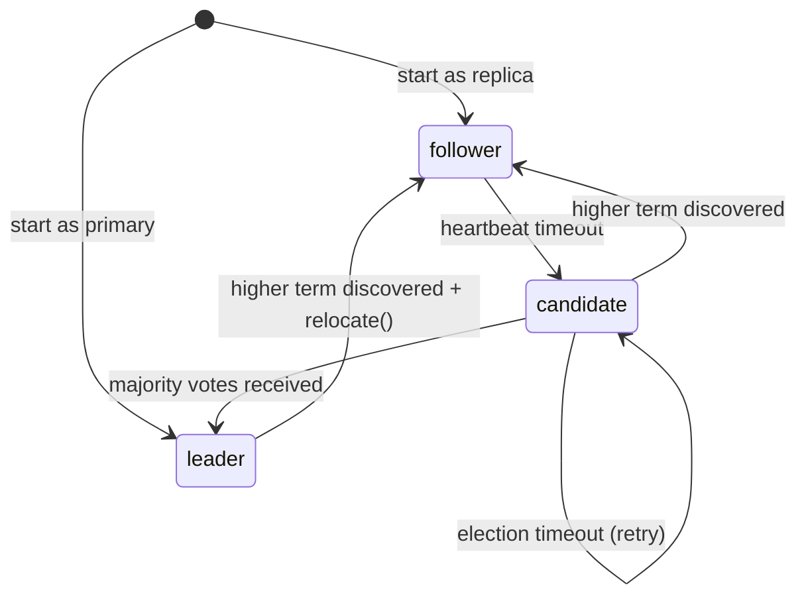
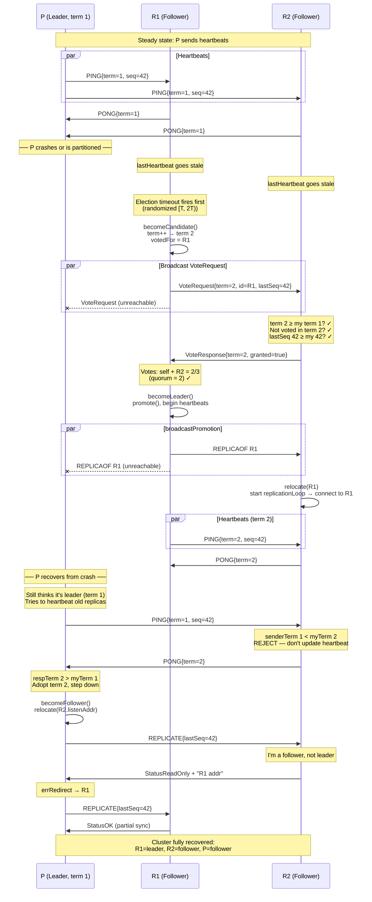
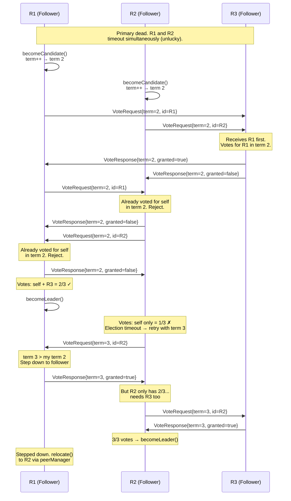

# Sabotage

Kill the primary. Watch the cluster sit there doing nothing until a human intervenes.

## The problem

Primary crashes at 3am. Replicas detect staleness (heartbeat timeout), start rejecting reads. All writes fail with `StatusReadOnly`. The cluster is effectively dead.

Recovery: SSH in, pick a replica, run `PROMOTE`. Hope you picked the right one. Hope nobody else promotes a different replica at the same time.

```
1. Start P (primary), R1, R2
2. Write key=abc to P, confirm replication
3. Kill P
4. Wait 5 seconds (heartbeat timeout)
5. Try GET on R1 → StatusReplicaTooStale
6. Try PUT on R1 → StatusReadOnly
7. Cluster is dead. Nobody's coming to save it.
```

## Deeper problem: no ordered leadership

`replid` is a random string. If R1 and R2 both self-promote:
- R1 gets replid `"abc123"`, R2 gets replid `"xyz789"`
- Which happened first? Which is legitimate? No way to tell.
- No ordering = no rejection of stale leaders = split brain.

Raft uses monotonic **term** numbers. Term 5 > term 3, always. A node won't accept a leader with a lower term than it's already seen.

We need the same: a monotonic counter that increases on every election attempt.

## Real systems

**Raft (etcd, CockroachDB):**
- Monotonic term number, incremented by candidate
- Randomized election timeout to avoid split votes (Raft paper: 150-300ms, etcd: 1000-1900ms)
- Candidate requests votes from all peers, needs majority
- Each node votes once per term (first-come-first-served), vote persisted to disk
- Leader sends heartbeats to maintain authority (etcd: every 100ms)

**MongoDB replica sets:**
- Nodes hold elections when primary unreachable (10-second election timeout)
- Term number (similar to Raft), embedded in OpTime as `(timestamp, term)`
- Priority field: higher-priority nodes call elections sooner
- Voter rejects candidate with older `lastWritten` OpTime (most up-to-date wins)
- Dry-run election first (avoid unnecessary term bumps), then real election

**Redis Sentinel (external approach):**
- Separate Sentinel processes monitor the primary
- Sentinels vote on failover: dual threshold — ODOWN quorum + strict majority for authorization
- Each sentinel votes once per epoch (first-come-first-served), randomized delay avoids ties
- Uses `current_epoch` (monotonic counter, equivalent to Raft term)
- Data nodes don't participate in election at all

Key difference: Raft/MongoDB embed election in data nodes. Sentinel keeps it external. We're going the Raft/MongoDB route — data nodes vote for themselves.

## Design space

### Option A: Epoch counter (replaces random replid)

Add `epoch uint64` to server state. Every election attempt increments it. Persisted to disk. Replaces `replid` as the timeline discriminator.

- ✅ Total ordering: epoch 5 > epoch 3
- ✅ Fencing: reject requests from lower epoch
- ✅ Simple: one atomic counter
- ❌ Breaking change: `replid` used everywhere for partial resync
- ❌ Need both? epoch for ordering + replid for timeline identity?

### Option B: Keep replid, add term alongside

Keep `replid` for what it does (timeline identity for resync). Add `term uint64` separately for election ordering.

- ✅ No breaking change to replication
- ✅ Clean separation: term = election ordering, replid = timeline identity
- ❌ Two concepts where Raft has one (term serves both purposes)
- ❌ More state to persist and propagate

### Option C: Replace replid with term entirely

Term is the timeline discriminator. Same term = same timeline. Different term = different timeline, full resync.

- ✅ One concept, like Raft
- ✅ Ordered AND identifies timeline
- ❌ Term is a number — two nodes can independently increment to the same term
- ❌ Need to pair with nodeId to disambiguate: `(term=5, nodeId=R1)` vs `(term=5, nodeId=R2)`

## The choice: Option B (keep replid, add term)

`replid` = replication timeline identity (random string, used for partial resync detection).
`term` = election ordering (monotonic uint64, used for leader legitimacy).

They solve different problems. Merging them creates collisions (two nodes independently reach same term with divergent data). Clean separation like Raft: term for elections, log index for replication.

## Implementation phases

### Phase 1: Term counter and persistence
- Add a `term uint64` field to Server. Persist it in `replication.meta`.
- A fresh primary initializes at term 1. Replicas adopt the primary's term during replication sync.
- `promote()` increments the term on each leadership change.
- No election logic yet — this phase only introduces the counter.

### Phase 2: Node state machine (`election.go`)
- Define three roles: `follower`, `candidate`, `leader` as `type Role uint32` with iota.
- Store as `role atomic.Uint32` on Server. Zero value = follower (safe default).
- Replicas start as followers; the primary starts as leader.



- `validTransition(from, to Role) bool` — pure guard encoding the 5 legal arrows above (+ follower→follower for idempotent relocate).
- Named methods `becomeCandidate()`, `becomeLeader()`, `becomeFollower()` on Server:
  validate via the guard, swap the atomic role, then trigger side effects.
- Callers never set `role` directly. The `isReplica` field is deprecated and replaced by role checks.
- Side effects (increment term, send votes, start heartbeats) happen inside the named methods, after the role swap.

### Phase 3: Failure detection and election trigger
- A background goroutine monitors `lastHeartbeat` on each follower.
- When `time.Since(lastHeartbeat)` exceeds the election timeout, the follower transitions to candidate.
- Election timeout is randomized between [2000ms, 4000ms) (10–20× heartbeat interval) to reduce split votes.
- On becoming candidate: increment term, vote for self, broadcast vote requests via PeerManager.

### Phase 4: Vote protocol
- New commands: `CmdVoteRequest` (term, candidateId, lastSeq) and `CmdVoteResponse` (term, granted).
- A node grants its vote only if: the candidate's term ≥ the node's current term, the node has not already voted in this term, and the candidate's lastSeq ≥ the node's own.
- `votedFor` is persisted to disk to prevent double-voting after a crash.
- A candidate that receives votes from a majority calls `promote()`, becomes leader, and begins sending heartbeats.

### Phase 5: Stale primary fencing
- PING carries the leader's term (8-byte LE in `Value`). PONG carries the responder's term.
- A replica that receives a PING with a lower term than its own rejects the heartbeat (does not update `lastHeartbeat`), and replies PONG with its own higher term.
- A leader that receives a PONG with a higher term adopts the term, clears `votedFor`, persists state, and steps down to follower.
- A follower/candidate that receives a PING with a higher term adopts the term, clears `votedFor`, and steps down to follower. Heartbeat is accepted.
- Same-term PING is accepted normally: update `lastHeartbeat` and `primarySeq`.

### Phase 6: Leader step-down recovery
After stepping down, a former leader (or candidate) becomes a disconnected follower — it has no replication connection and no idea who the new primary is. Without recovery, it sits idle until an external `REPLICAOF` arrives.

**Step-down triggers** (all paths that transition to follower from a non-follower role):

| Trigger | Where | Has peer address? |
|---|---|---|
| PONG with higher term | `handlePong` | Yes — `peerManager.AnyAddr()` (any known peer) |
| VoteResponse with higher term | `tickElection` | Yes — the peer that denied the vote |
| VoteRequest with higher term | `evaluateVoteLocked` | Yes — `vr.nodeID` (but need addr from `peerManager`) |
| PING with higher term | `handlePing` | Yes — already connected to sender (replication conn) |
| `broadcastPromotion` (REPLICAOF) | `handleReplicaOf` → `relocate()` | Yes — payload is the new leader's addr |

The PING and `broadcastPromotion` cases are already handled: the node is either already connected (PING path) or `relocate()` starts the replication loop. The gap is PONG and VoteResponse — the node steps down but never calls `relocate()`.

**Recovery approach: `relocate` after leader step-down**

When a leader steps down via `handlePong`:
1. Pick any known peer via `peerManager.AnyAddr()` — replica transport is already gone by this point
2. Call `relocate(addr)` in a goroutine — this starts `replicationLoop`
3. `connectToPrimary()` sends REPLICATE to that address
4. If that node is the new leader → direct connection, done
5. If that node is a follower → responds `StatusReadOnly` + leader addr → `errRedirect` → one hop to real leader

When a candidate steps down via `tickElection` (VoteResponse with higher term):
1. Pick any peer from `peerManager` — the one that denied the vote is a good start
2. Call `relocate(addr)` — same redirect chain as above

This reuses the existing `errRedirect` mechanism. No new wire format. No broadcast. One deterministic hop plus at most one redirect.

### Phase 7: Persist peer topology
Peer addresses are learned at runtime (TOPOLOGY command from primary). After a crash, this knowledge is lost — `peerManager` is empty. A restarted leader with zero peers wins a trivial 1-node election (quorum=1) and creates a split brain.

**Fix:** Persist peer topology in `replication.meta` alongside existing state. On `restoreState()`, re-populate `peerManager` so the node can contact real peers before starting elections.

- `storeState()` serializes `peerManager` entries as `peers:nodeID1@addr1,nodeID2@addr2,...`
- `restoreState()` parses the `peers:` line and calls `SavePeers()`
- `PeerManager.PeerInfos()` returns the current topology for serialization
- Every `storeState()` call (term bump, vote, step-down) automatically persists the latest topology
- `broadcastTopology()` calls `peerManager.SavePeers()` on the primary itself (replicas receive topology via the TOPOLOGY command; the primary must self-save)
- `handleTopology()` (replica side) already calls `SavePeers()` — no change needed there

**Real systems:** etcd persists membership as Raft log entries. Redis Cluster writes `nodes.conf` on every state change. Redis Sentinel rewrites `sentinel.conf`. All persist topology — none rely on in-memory-only knowledge surviving crashes.

**Partitioned follower recovery:**
A follower whose primary dies will time out and become a candidate. If it can't reach quorum (still partitioned), it stays candidate and keeps retrying. When the partition heals:
- If the old primary is alive and has stepped down → follower connects, gets `StatusReadOnly` + redirect to new leader
- If the old primary is dead → follower's `replicationLoop` fails to connect, election timeout fires, candidate can now reach quorum and either win or discover the existing leader via VoteResponse

No special mechanism needed — the existing `replicationLoop` retry + `errRedirect` + election timeout cover this case.

**Vote protocol sequence (full — includes fencing, step-down, and recovery):**



**Split vote and retry:**



## References

- Raft paper (Ongaro & Ousterhout, 2014) §5.2: Leader election, one vote per term, randomized election timeout
- etcd raft implementation: `raft.go` — `becomeCandidate()`, `tickElection()`, `Step()` vote handling
- MongoDB replica set elections: term in OpTime, `lastWritten` comparison, dry-run elections, priority-based timeout
- Redis Sentinel: `sentinel.c` — `current_epoch`, ODOWN quorum + majority authorization, `sentinelVoteLeader()`
