# Sabotage

Kill two replicas. Restart them without `--replica-of`. They elect a new leader at term 5. Old primary is still alive at term 3, happily accepting writes into a divergent timeline. Nobody tells it to stop.

## The problem

`broadcastPromotion` is fire-and-forget. If the old primary is unreachable when it fires, the message is lost. No retry. The old primary sits as a stale leader indefinitely.

```
t=0  P(term=3), R1, R2 — healthy
t=1  R1, R2 partitioned from P
t=2  R1 elected leader at term=5
t=3  broadcastPromotion → P unreachable → dropped
t=4  Partition heals — nobody contacts P
t=5  P accepts writes at term=3 → SPLIT BRAIN
```

Three discovery paths, all broken today:
1. **New leader contacts it** — broadcastPromotion, one-shot
2. **Follower rejects replication** — no connected replicas remain
3. **Leader detects silence** — leaders don't check

## Real systems

**etcd — CheckQuorum.** Hardcoded `CheckQuorum: true`. The raft library tracks heartbeat responses; every `ElectionTick` the leader calls `QuorumActive()` — if fewer than majority responded, `becomeFollower(r.Term, None)`. Self-demotion, no external agent. `PreVote` prevents a rejoining stale node from disrupting the cluster with unnecessary term bumps.

**TiKV — CheckQuorum + leader lease.** Same raft protocol via `raft-rs`. Adds a leader lease (default 9s) for local reads — config validation enforces `lease < election_timeout`, guaranteeing the lease expires before a new leader can be elected. On step-down, lease is immediately invalidated. Force-leader (disaster recovery) temporarily disables CheckQuorum and re-enables on exit.

**Redis Sentinel — external monitor.** Masters have no term. Sentinel polls `INFO` every 1–10s, detects role mismatches, and fires `SLAVEOF <new-master>` to demote the old master. Retries indefinitely — main loop runs every ~100ms per instance.

| | etcd | TiKV | Redis Sentinel |
|---|---|---|---|
| **Who fences** | Leader (raft) | Leader (raft) | External process |
| **During partition** | Steps down proactively | Steps down proactively | Old master serves stale data |
| **After heal** | Already resolved | Already resolved | Retries SLAVEOF ∞ |

We don't have a Sentinel. We need CheckQuorum.

## Design space

**Option A: CheckQuorum (leader self-demotion).** Leader tracks which replicas responded (PONG, ACK, NACK) within the last election timeout. Fewer than quorum active → step down. Proactive — works during partition. Matches etcd/TiKV. Caveat: standalone leader (no peers) must skip the check.

**Option B: Periodic promotion retry.** New leader re-broadcasts REPLICAOF to unreached peers every few seconds. Belt-and-suspenders — accelerates convergence after partition heals, but doesn't prevent stale writes during partition.

**Option C: Peer heartbeat gossip.** PeerManager pings all peers with current term. Rejected — makes PeerManager active, overlaps with existing heartbeat paths.

## Decision

**Option A + B.** CheckQuorum is the primary defense (proactive, during partition). Periodic promotion retry is the complement (reactive, after heal). Option C rejected.

## Flow

```mermaid
sequenceDiagram
    participant P as P (term=3)
    participant R1 as R1
    participant R2 as R2

    note over P,R2: Healthy cluster

    rect rgb(40,40,40)
    note right of P: Partition
    P--xR1: ✕
    P--xR2: ✕
    end

    rect rgb(60,30,30)
    note over P: CheckQuorum (Phase 1)
    P->>P: recentActive? R1=✗ R2=✗
    P->>P: 0+1 < quorum(2) → step down
    note over P: becomeFollower + relocate
    end

    rect rgb(30,50,30)
    note over R1,R2: Election (existing)
    R1->>R2: RequestVote(term=5)
    R2->>R1: VoteGranted
    R1->>R1: becomeLeader(term=5)
    end

    note over P,R2: Partition heals

    rect rgb(30,30,60)
    note over R1: Reconciliation (Phase 2)
    R1->>P: REPLICAOF R1
    P->>R1: REPLICATE(nodeID=P)
    R1->>P: Full sync
    note over P: Follower of R1
    end
```



## Implementation plan

### Phase 0: Re-key replicas map by nodeID

Prerequisite refactoring. Today `s.replicas` is `map[StreamTransport]*replicaConn` — keyed by ephemeral connection. PING failure kills the goroutine and deletes the entry. When the replica reconnects it creates a brand-new entry. CheckQuorum needs to count replicas that *exist but stopped responding*, which requires keeping disconnected entries in the map.

Re-key to `map[string]*replicaConn` (keyed by stable `nodeID`). Add `connected bool` to `replicaConn`. On PING/write failure: goroutine exits, sets `connected = false`, closes transport — but entry stays. On reconnect (`handleReplicate`): look up by `nodeID`, swap transport + `sendCh`, set `connected = true`, spawn new writer goroutine.

```
replicas map:  nodeID → replicaConn { transport, sendCh, connected, ... }

disconnect:  connected = false, close transport, goroutine exits
reconnect:   swap transport + sendCh, connected = true, new goroutine
```

### Phase 1: CheckQuorum on leader

Add `recentActive bool` to `replicaConn`. Every election timeout, count replicas in the map (connected or not), check how many had `recentActive == true`, reset flags. If `active + 1 < quorum` → `becomeFollower()` + `relocate()`.

```
every electionTimeout:
  active = count replicas where recentActive == true
  reset all recentActive = false
  if active + 1 (self) < quorum → step down
```

Mark `recentActive = true` on any response: PONG, ACK, NACK. Disconnected replicas are never marked — they count against quorum.

### Phase 2: Periodic reconciliation

**Prerequisite (done): `SavePeers` → `MergePeers`.** `broadcastTopology` used to call `SavePeers` with only the replicas map — a full replace. The old primary (which was never a replica of the new leader) got dropped. The reconciliation loop can't reach a node it doesn't know about.

`MergePeers` upserts entries and never deletes. The peer list is append-only — a historical node stays until explicitly removed (which we never do). `handleTopology` on followers uses the same merge semantics.

```
MergePeers(new []PeerInfo):
  for each peer in new:
    peers[peer.NodeID] = peer   // upsert
  // no deletions
```

With peers preserved, the reconciliation loop can find the old primary.

While leader, every few seconds, check which peers haven't connected as replicas. Send REPLICAOF to unreached peers. Stop once connected.

```
every reconcileInterval (while leader):
  for each peer not in connected replicas:
    send REPLICAOF <self>
```

### What changes

| File | Change |
|------|--------|
| `server.go` | `replicas` type → `map[string]*replicaConn` |
| `replication.go` | Add `connected`, `recentActive` to `replicaConn`; `addNewReplica` keyed by `nodeID`; `serveReplicaWriter` defer marks `connected = false` instead of delete |
| `handler_cluster.go` | `handleReplicate` reconnect logic (lookup by `nodeID`, swap transport); periodic reconciliation loop — done |
| `handler_heartbeat.go` | Mark `recentActive` in PONG; add CheckQuorum to leader branch — done |
| `handler_put.go` | Mark `recentActive` in ACK/NACK — done |
| `peer_manager.go` | `SavePeers` → `MergePeers` (upsert, never delete) — done |

### Edge cases

- **Standalone (no peers):** Skip. Gate on `len(peers) >= 2`.
- **3-node, 1 disconnect:** active=1 + self=1 = 2 ≥ quorum(3)=2 → stays leader.
- **3-node, both disconnect:** 0 + 1 = 1 < 2 → step down.
- **Flapping:** Step-down → follower → `relocate()`. Can't win election without quorum. Stable.
- **Interval:** Election timeout (~2s). Same as Raft.
- **Reconnect race:** Writer goroutine exiting and new `handleReplicate` arriving concurrently — `connectionMu` serializes.
- **Orphaned old primary:** New leader never had old primary as a replica. `broadcastTopology` must not erase it from peers — `MergePeers` preserves it so reconciliation loop can send REPLICAOF.

## Issues found during integration

Six bugs surfaced during integration testing. Each one was invisible in unit tests — they only appeared under real network topology with concurrent goroutines, actual TCP connections, and timing-dependent transitions.

**#1 — Send on closed channel in broadcastTopology.** `broadcastTopology` iterates `s.replicas` and writes to `rc.sendCh`. Meanwhile `updateReplicaConn` closes the old `sendCh` when a replica reconnects. The two goroutines race: send to a channel that just closed → panic. Fix: gate all sends on `rc.connected.Load()`; set `connected=false` *before* `close(sendCh)`. The connected flag acts as a soft lock — senders see `false` and skip; the channel close only affects the writer goroutine draining it.

**#2 — Self-redirect infinite loop.** Fenced P steps down, dials R1 (a follower). R1 sends `StatusReadOnly` with P's own address as the leader redirect. P follows the redirect back to itself. Tight loop: connect → redirect → connect → redirect. Fix: detect `redir.addr == s.listenAddr()` and back off. Also detect redirect cycles (A→B→A→B) by tracking `lastRedirFrom` — if the redirect target matches the source of the previous redirect, back off with `retryInterval`.

**#3 — Post-fence election disruption.** CheckQuorum fires, P steps down. But `lastHeartbeat` is stale (no heartbeats in a while — that's why fence fired). `monitorHeartbeat` wakes, sees stale `lastHeartbeat`, triggers `becomeCandidate()` immediately. The election cancels `replCtx`, killing P's replication loop before it connects to the new leader. P oscillates: follower → candidate → follower → candidate. Fix: two-part defense. (a) Set `lastHeartbeat = time.Now()` on fence step-down, buying time. (b) `fenced atomic.Bool` flag — `monitorHeartbeat` skips election while fenced. `handlePing` clears `fenced` on first valid leader heartbeat, re-enabling normal election behavior.

**#4 — `primarySeq` uint64 underflow.** Leader has `primarySeq=0` (never received a heartbeat; leaders don't get PINGs). On step-down via `relocate()`, the node becomes a follower with `lastSeq=N`. `isStaleness()` computes `primarySeq - lastSeq = 0 - N`, which wraps to a huge uint64 (unsigned subtraction). Every GET returns `StatusReplicaTooStale` until the first heartbeat arrives and sets `primarySeq`. Fix: `relocate()` sets `primarySeq = s.lastSeq.Load()` on leader→follower transition, starting with zero lag.

**#5 — `WriteTimeout=0` creates expired context.** `context.WithTimeout(ctx, 0)` returns an already-cancelled context. When `WriteTimeout=0` (meaning "no timeout"), every `rc.transport.Send()` in `serveReplicaWriter` fails immediately. Only full sync on reconnect worked — incremental replication was silently broken. Pre-existing bug, exposed by the fence flow. Fix: check `WriteTimeout > 0` before calling `WithTimeout`; use `context.Background()` when zero. Also added `pingTimeout()` with 500ms fallback for the same `ReadTimeout=0` issue on PING.

**#6 — Reconcile recruits peers before fence fires.** R1 and R2 restart on the same ports. P's `reconcileLoop` (every 3s) sees them as unconnected peers and sends REPLICAOF, recruiting them back as replicas before `monitorFence` (every ~2-4s) has time to fire. P regains quorum and stays leader — split brain continues. Fix: `reconcilePeers` skips when `len(snapshot) > 0 && connectedCount == 0`. A leader with known replicas but none connected is likely stale — let the fence fire first.
