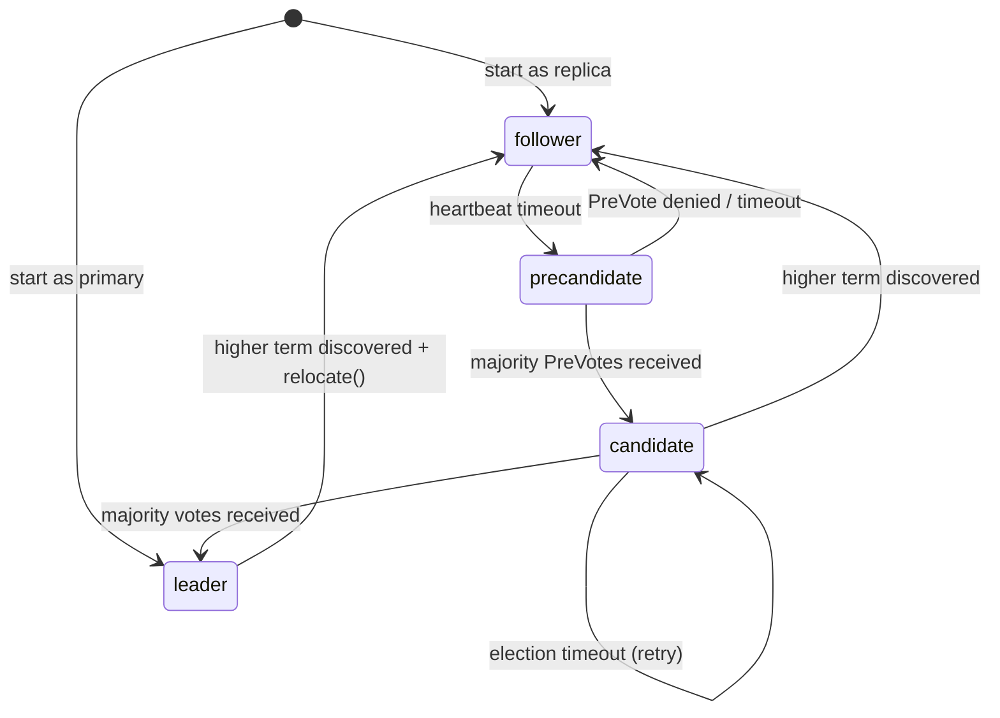

# Sabotage
A partitioned follower campaigns repeatedly, inflating its term. When it reconnects, its sky-high term forces the healthy leader to step down — disrupting the entire cluster for a node that was never viable.

## The problem

**Term inflation under partition:** A follower loses contact with the leader. After election timeout, it calls `becomeCandidate()`, which increments its term and starts `tickElection()`. No peers are reachable, so the election fails. Next timeout: another `becomeCandidate()`, another term bump. After N timeouts, its term is `originalTerm + N`.

**Reconnection damage:** When the partition heals, the node sends VoteRequest with its inflated term. Every peer receiving a higher term steps down unconditionally (`evaluateVoteLocked` stores the new term, transitions to follower). The healthy leader abdicates even though it was serving the cluster correctly.

**Current mitigation and its gap:** The `fenced` flag suppresses elections on quorum-loss step-down. But fencing only activates when a leader detects quorum loss — it doesn't cover a follower that was simply partitioned from the start.

**The deeper issue:** `becomeCandidate()` increments the term _before_ knowing whether the election has any chance of succeeding. The term is a scarce, monotonically increasing resource. Burning it speculatively is safe in a connected cluster (failed elections are rare), but toxic under partition.

## Real systems

**etcd (Ongaro dissertation §4.2.3 — PreVote):**
- Two-phase election: PreVote phase probes viability without incrementing term
- `becomePreCandidate()` does NOT increment term, does NOT persist `votedFor`
- PreVote messages carry `r.Term + 1` — the term the node _would_ campaign for
- Receivers evaluate log completeness and term, but never change their own term or votedFor in response to a PreVote
- Key invariant: "Never change our term in response to a PreVote"
- PreVote wins majority → proceed to real `campaign(campaignElection)` (increments term, full election)
- PreVote loses → remain follower. No term damage done. No state persisted.
- `StatePreCandidate` is a distinct state from `StateCandidate`
- CheckQuorum interaction: followers receiving regular heartbeats from a leader reject PreVote — prevents a reconnecting node from disrupting a healthy cluster even if its log is equally complete

**TiKV:**
- Uses etcd's raft library (identical PreVote implementation via `raft-rs`)

**CockroachDB:**
- Also uses etcd's raft library with PreVote enabled by default

**Consul:**
- Implements PreVote in its own Raft library
- Same two-phase approach: probe first, then campaign

## Design space

### Option A: PreVote as separate message type
```
New protocol commands:
  CmdPreVoteRequest  = 15
  StatusPreVoteResponse (new status)

New role:
  RolePreCandidate (between Follower and Candidate)

Flow:
  heartbeatLoop timeout
    → becomePreCandidate()  [no term increment, no votedFor]
    → tickPreElection()     [send PreVoteRequest at term+1]
    → majority grants?
      → YES: becomeCandidate() [real term increment, real election]
      → NO:  becomeFollower()  [no damage]

Receiver evaluatePreVoteLocked():
  - Same log completeness check as evaluateVoteLocked
  - Never store votedFor
  - Never update own term
  - If follower receiving heartbeats from leader: reject (lease check)
```
- ✅ Clean separation: PreVote and Vote are distinct protocol paths
- ✅ Matches etcd exactly (MsgPreVote / MsgPreVoteResp)
- ✅ No ambiguity in handler dispatch
- ✅ Easy to reason about: "PreVote touches nothing, Vote touches everything"
- ❌ Two new protocol constants, parallel builder/parser functions

### Option B: Flag on existing VoteRequest
```
Extend VoteRequestValue with IsPreVote bool field.
Reuse CmdVoteRequest / StatusVoteResponse.

evaluateVoteLocked checks IsPreVote:
  - If true: evaluate but don't update term/votedFor/persist
  - If false: existing behavior
```
- ✅ No new Cmd/Status constants
- ✅ Fewer code paths
- ❌ Flag coupling: single handler with branching logic ("if preVote then don't persist")
- ❌ Easy to forget one of the "don't persist" branches
- ❌ Doesn't match real systems (they use distinct message types)

### Option C: Heartbeat lease check only (no PreVote)
```
Followers receiving recent heartbeats reject any VoteRequest:
  if time.Since(lastHeartbeat) < electionTimeout { reject }

Prevents disruption from reconnecting partitioned nodes
without any protocol changes.
```
- ✅ Zero protocol changes
- ✅ Simple: one conditional in evaluateVoteLocked
- ❌ Doesn't prevent term inflation (partitioned node still campaigns, just can't win)
- ❌ Reconnection still forces step-down (higher term in VoteRequest)
- ❌ Only solves half the problem (disruption at receiver, not at sender)

## The choice: Option A (Separate PreVote message type)

**Rationale:**
- Clean mental model: PreVote is a _probe_ (read-only), Vote is a _mutation_ (term++, votedFor, persist). Distinct message types make this invariant structural, not behavioral.
- Matches etcd's design exactly — if someone reads our election code alongside etcd's raft library, the mapping is 1:1.
- Option B's flag approach is a correctness trap: one missed `if !isPreVote` branch and we persist votedFor during a PreVote, violating the core invariant.
- Option C is orthogonal — we'll add the lease check _inside_ PreVote evaluation (reject PreVote if receiving heartbeats), but it alone doesn't prevent term inflation at the sender.

**Learning:** Two-phase protocols (PreVote/Vote, Prepare/Accept, Try/Confirm) are a recurring pattern in distributed systems. The probe phase makes the mutation phase safe by establishing preconditions without side effects.

## Implementation plan

| What | Where | Detail |
|---|---|---|
| `CmdPreVoteRequest = 15` | `protocol/message.go` | New command type |
| `StatusPreVoteResponse` | `protocol/message.go` | New status code |
| `NewPreVoteRequest()`, `NewPreVoteResponse()` | `protocol/builders.go` | Reuse `VoteRequestValue` / `VoteResponseValue` format |
| `RolePreCandidate` | `election.go` | New role. Transitions: Follower→PreCandidate, PreCandidate→Candidate, PreCandidate→Follower |
| `becomePreCandidate()` | `election.go` | CAS role. No term++, no votedFor, no persist |
| `tickPreElection()` | `election.go` | Send `CmdPreVoteRequest` at term+1. Majority → `becomeCandidate()`. Denied → `becomeFollower()` |
| `heartbeatLoop()` change | `handler_heartbeat.go` | Timeout calls `becomePreCandidate()` instead of `becomeCandidate()` |
| `handlePreVoteRequest()` | `handler_cluster.go` | Dispatcher entry + `evaluatePreVoteLocked()` |
| `evaluatePreVoteLocked()` | `handler_cluster.go` | Stale term → reject. Short log → reject. Lease check (recent heartbeat) → reject. Else grant. **Never** mutate term/votedFor/persist/role |

**Unchanged:** `tickElection()`, `storeState()`/`restoreState()` (PreCandidate is transient), `fenced` flag (suppresses at heartbeatLoop level — no PreCandidate either).

### Updated State machine (was 031 Phase 2)



## Test strategy

### Unit tests
- `TestPreCandidateTransitions`: verify valid/invalid transitions for RolePreCandidate
- `TestBecomePreCandidate_NoTermIncrement`: call becomePreCandidate(), assert term unchanged, votedFor empty
- `TestEvaluatePreVoteLocked_GrantsWhenEligible`: same term+1, complete log → grant
- `TestEvaluatePreVoteLocked_RejectsStale`: proposed term < myTerm → reject
- `TestEvaluatePreVoteLocked_RejectsShortLog`: lastSeq behind → reject
- `TestEvaluatePreVoteLocked_LeaseCheck`: follower with recent heartbeat → reject
- `TestEvaluatePreVoteLocked_NeverMutatesState`: after evaluation, assert term/votedFor/storeState unchanged

### Integration tests
- `TestPreVote_PartitionedNodeRejoins`: partition a follower, let it timeout N times, heal partition, verify leader remains stable (no step-down)
- `TestPreVote_NormalElection`: kill leader, verify PreVote → Vote → new leader (functional path)

## Design lessons

**Speculative mutations are dangerous.** Incrementing term before knowing whether an election is viable is a speculative mutation — safe in the common case, catastrophic under partition. PreVote converts the speculative mutation into a two-phase protocol: probe viability first (read-only), then mutate (term++, votedFor, persist) only when success is likely.

**Lease checks complement term protection.** PreVote prevents term inflation at the _sender_. The lease check (reject PreVote if receiving heartbeats) prevents disruption at the _receiver_. Both are needed: without PreVote, the sender inflates terms. Without lease check, a reconnecting node with a complete log could still trigger unnecessary elections.

**Crash safety is free.** PreCandidate is a transient state — the node hasn't incremented its term or recorded a vote. On crash, it restarts as follower with the same term it had before. No new persistence requirements. This is the beauty of the two-phase approach: the probe phase has no durable side effects.
