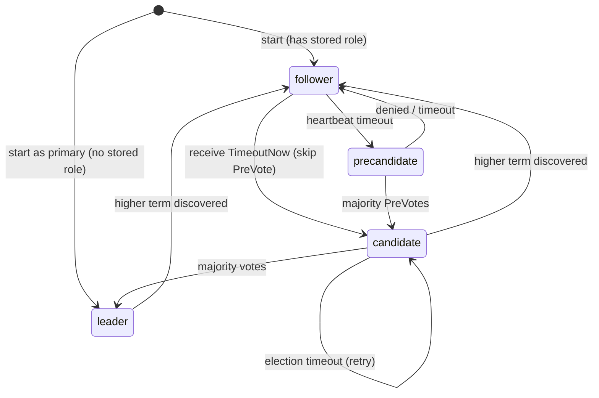

# Sabotage
You need to patch the leader. You kill it. The cluster elects a new leader — eventually. But "eventually" is 2-4 seconds of election timeout plus PreVote round-trip, during which every write fails. Operators deserve a zero-downtime knob: move leadership to a specific follower *before* touching the leader.

## The problem

**No graceful handoff.** The only way to change leadership is to kill the leader and let the election mechanism figure it out. Writes fail during the election window, and the new leader is whichever follower times out first — not necessarily the one the operator intended.

**PreVote blocks authorized transfers.** PreVote's lease check (ep034) rejects elections from nodes receiving recent heartbeats. But during a planned transfer, the target *has* a recent heartbeat. The safety mechanism blocks the authorized operation.

**No write fence.** Once the leader sends "go campaign" to the target, it must stop accepting new writes. Otherwise writes arriving between the signal and the target's election could be lost.

## Real systems

**etcd (Ongaro dissertation §3.10 — Leadership transfer):**
- Leader stores `leadTransferee`, checks if target is caught up (`pr.Match == lastIndex()`)
- Caught up → sends `MsgTimeoutNow` immediately. Behind → catches up first via AppendEntries, then sends TimeoutNow
- While `leadTransferee != None`, leader rejects all proposals (`ErrProposalDropped`) — the write fence
- Target receiving `MsgTimeoutNow` skips PreVote, goes straight to real Vote with `Context: "CampaignTransfer"` — receivers bypass lease check via this `force` flag
- Safety timeout: if `electionTimeout` passes without completion → `abortLeaderTransfer()`, resume writes

**Redis — `CLUSTER FAILOVER`:**
- Replica tells master to stop writes, master replies with replication offset
- Replica waits until own offset matches, then starts failover via gossip (config epoch, not term-based)
- `FORCE`: skip handshake (master unreachable). `TAKEOVER`: skip consensus entirely (DC switchover)

## Design space

### Option A: Leader-initiated TimeoutNow (etcd model)
```
Operator → Leader: CLUSTER TRANSFER <targetNodeID>
Leader:
  1. Validate target is connected peer
  2. Set transferring=true → reject writes with StatusError
  3. Send CmdTimeoutNow with Seq=s.seq to target over peer channel
  4. Start deadline timer (electionTimeout)

Target (follower):
  1. Receive CmdTimeoutNow with Seq=S
  2. Set transferDeadline = now + electionTimeout
  3. If s.lastSeq >= S → caught up, skip PreVote, call becomeCandidate()
  4. If s.lastSeq < S → store pendingTransferSeq=S, wait for replication to deliver remaining entries
  5. On each applyReplicatedPut(): if pendingTransferSeq > 0 && s.lastSeq >= pendingTransferSeq → becomeCandidate()
  6. If transferDeadline passes before catch-up → clear pendingTransferSeq (stale transfer)
  7. becomeCandidate() increments term, sends VoteRequest to all peers

Other followers:
  1. Receive VoteRequest at term+1
  2. evaluateVoteLocked(): higher term + log complete → grant

Old leader:
  1. Receives VoteRequest at higher term → steps down

Timeout: both sides use electionTimeout. The leader aborts (resumes writes) if a higher-term VoteRequest doesn't arrive in time. The target clears pendingTransferSeq if catch-up doesn't finish in time. electionTimeout (2s) >> network RTT — same approach as etcd/raft-rs.
```
- ✅ Matches etcd's proven design
- ✅ No new VoteRequest flag needed (our lease check is PreVote-only)
- ✅ Operator-initiated, explicit target selection
- ✅ Write fence prevents data loss during handoff
- ✅ Target-side catch-up: waits until own seq matches leader's seq before campaigning
- ❌ New protocol command needed (`CmdTimeoutNow`)

### Option B: Target-initiated voluntary campaign (Redis-style)
- Target contacts leader: "stop writes, tell me your seq" → waits for own seq to match → starts election
- ✅ Target knows for certain it's caught up. Works if leader unreachable (`FORCE` mode)
- ❌ Two-phase coordination + new messages (FailoverRequest/Grant). PreVote lease still blocks

### Option C: External orchestrator drains and kills
- Script checks lag, removes leader from load balancer, kills process, hopes election picks the right node
- ✅ Zero code changes
- ❌ No control over target, writes fail during election window

## The choice: Option A (Leader-initiated TimeoutNow)

**Rationale:**
- Our system uses Raft-style term-based elections. The etcd pattern fits naturally.
- Simpler than etcd: our lease check lives only in `evaluatePreVoteLocked()`. etcd's is in the shared `Step()` function, so it needs a `campaignTransfer` force flag on VoteRequest. We just skip PreVote — no force flag needed.
- Catch-up without `matchIndex`: etcd tracks `pr.Match` per peer continuously; we push it to the target. Leader sends its current `seq` inside TimeoutNow. Target checks its own `lastSeq` — if behind, it waits for the replication stream to deliver remaining entries. Same safety guarantee, no continuous tracking.
- Write fence pattern mirrors existing `cleanupInProgress atomic.Bool` — proven in our codebase.

**Learning:** TimeoutNow is authority delegation — the leader vouches for the target's right to campaign. Same pattern as certificate signing, OAuth tokens, and Paxos Prepare/Promise.

## Manual transfer vs proactive election

Both paths end at `becomeCandidate()`. The difference is *who decides* and *what's skipped*:

|  | Proactive election (ep020) | Manual transfer (this episode) |
|---|---|---|
| **Trigger** | Heartbeat timeout — follower suspects leader is dead | Operator sends `CLUSTER TRANSFER` — leader is alive |
| **Who initiates** | Follower autonomously | Leader on behalf of operator |
| **PreVote** | Yes — prevents term inflation, lease check blocks nodes with recent heartbeats | Skipped — target has a recent heartbeat, PreVote would reject |
| **Catch-up** | Not needed — follower already has what it has | Required — leader sends its `seq` in TimeoutNow, target waits until `lastSeq >= seq` |
| **Write fence** | None — old leader doesn't know it's about to lose | Yes — leader sets `transferring=true`, rejects writes immediately |
| **Term bump** | `becomeCandidate()` increments term | Same — `becomeCandidate()` increments term |
| **Log completeness** | Voters check candidate's log is at least as complete as theirs | Same check — no special handling |
| **Safety timeout** | Election timeout → retry with new term | Election timeout → abort transfer, resume writes |

The transfer reuses the election mechanism but replaces the trigger: instead of "I haven't heard from the leader," it's "the leader told me to take over." `TimeoutNow` is the bridge — it means "act as though your election timeout just fired, but skip the safety checks that assume the leader is dead."

### Sequence diagram

```
Operator          Leader (P)           Target (R1)          Peer (R2)
   |                  |                     |                   |
   |--TRANSFER R1---->|                     |                   |
   |                  |--transferring=true--|                   |
   |                  |  (reject writes)    |                   |
   |<----OK-----------|                     |                   |
   |                  |---TimeoutNow(S)---->|                   |
   |                  |                     |                   |
   |                  |           [if lastSeq < S: wait]        |
   |                  |---repl entries----->|                   |
   |                  |                     |--(lastSeq reaches S)
   |                  |                     |                   |
   |                  |                     |--becomeCandidate()|
   |                  |                     |  term++ = T+1     |
   |                  |                     |--VoteReq(T+1)---->|
   |                  |<--VoteReq(T+1)------|                   |
   |                  |  (step down,        |                   |
   |                  |   T+1 > T, grant)   |<--VoteResp(grant)-|
   |                  |--VoteResp(grant)--->|                   |
   |                  |                     |--becomeLeader()   |
   |                  |                     |  (start heartbeat)|
```

### State machine update



New transition: `Follower → Candidate` (bypassing PreCandidate) — only via `TimeoutNow`. Requires updating `validTransition()`. `handleTimeoutNow()` also clears `fenced` flag (TimeoutNow is authoritative leader contact). If the target isn't caught up, it stores `pendingTransferSeq` and the transition happens later when replication delivers the remaining entries.

## Design lessons

**Write fencing is the universal transfer primitive.** Every leadership transfer — Raft, Paxos, Redis, ZooKeeper — has the same core step: the old leader must *stop accepting writes* before the new leader starts. Without this fence, two nodes both accept writes, violating the single-writer invariant. An `atomic.Bool` is enough.

**Safety mechanisms need escape hatches.** PreVote's lease check blocks authorized transfers. etcd adds a `force` flag; we skip PreVote entirely. The general lesson: every safety mechanism should have a well-defined override path, or it becomes an obstacle to operations.
