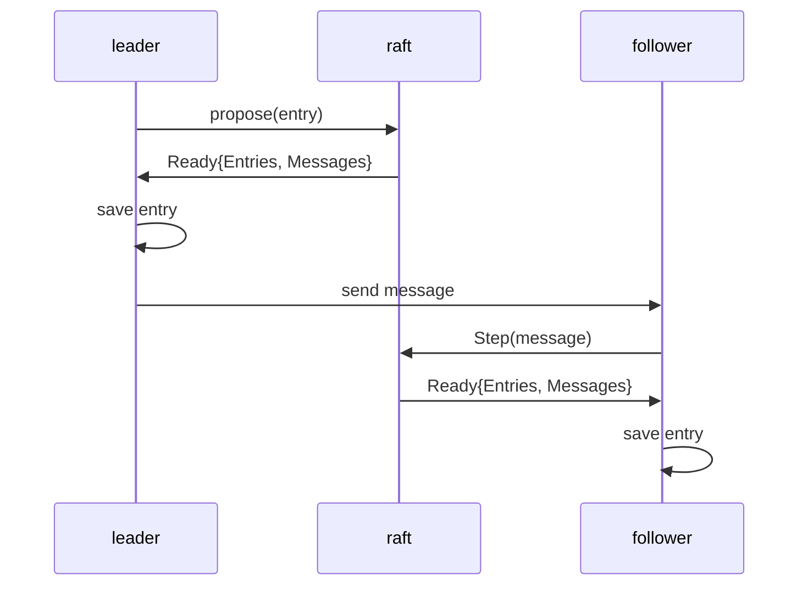

# 036f - The Step

Let's review what we have built for making Raft reasonable:
- 036b built the loop
- 036c made state survive restart
- 036d made committed state wait for apply
- 036e made old history compress behind a semantic boundary

A solid Raft skeleton was built and proved. But it stays locally, the transitions are mocked by unit tests. **Where do transitions actually com from?**

`Step`. 036f protects: **a follower appends an entry because it received a message through `Step`, not because of a local shortcut**. Without `Step`, the current Raft is still a local data structure with a delivery loop around it.

`Step` is where the algorithm starts becoming a distributed state machine. In 036f, one node acts as leader and one node acts as follower. The leader emits replication intent, and the follower changes state only after receiving a message. With `Step`, the transition finally becomes visible.

There are many message types in the Raft paper. In 036f, I only need the replication path. That keeps the episode bounded while making the model honest enough for later messages to plug in naturally.

The flow starts when the leader receives a proposal, then what? Without Raft, the old idea is directional: persist the proposal, send a message to the followers, wait for quorum, and then apply the entry to the state machine. That idea blocks me here. The blocker is that Raft is not a helper component. It is the source of truth. It drives the outside world to evolve, not vice versa.

**More importantly, it shows a signal that I'm starting to understand Raft in the real world.** The algorithm feels vague when I'm reading the paper and the source code of `etcd/raft`. It becomes a concrete shape when I meet the blocker on forcing myself to think about the details.

Let me draw a diagram to shape my thinking:


Based on the diagram, 036f needs to build `Step` that handles `Message`, which is where the transition becomes visible. Look at how `etcd/raft` defines `Message`, it's a big one, and that is the full shape of a `Message`, but for 036f I think a pretty simple definition is enough:
```go
type MessageType int32

const (
    MsgApp MessageType = 1
)

type Message struct {
   Type MessageType
   Entries []Entry
}
```

And we need to tell outside world that there are messages to send out, so `Ready` gets a new field:
```go
type Ready struct {
    ...
    Messages []Message
}
```

Now we have all the required instances there, then the flow works like:
```go
// leader received a proposal
node.Propose(entry)
leader <- Ready
leader.Save(entry)
leader.Send(message)
node.Advance()

// follower received a message
follower.Step(message)
follower <- Ready
follower.Save(entry)
follower.Advance()
```

I have left a hole above: where does the message get created? It should be inside the Raft state machine. That is the real correction in 036f. `Propose` and `Step` change the state machine, and the resulting outbound work becomes visible through `Ready`.

## Minimum tests

When I think about the tests, mocking the whole outside world comes up immediately. That expands the scope and blurs the boundary. But `Step` is the entry point and the new thing built in 036f, so the tests should only prove that the new message-driven path becomes visible through `Ready`. No larger mock is needed yet.

#1 `TestAppendMessageIsReadyAfterLeaderPropose_036f` proves that after leader `Propose`, `Ready` exposes an append message but the entry is not committed.

#2 `TestNewEntryIsReadyAfterFollowerStepMsgApp_036f` proves that after follower `Step(MsgApp)`, follower `Ready` exposes the new entry for persistence.

## Bounded scope

036f is complete when:
- leader `Propose` exposes replication work through `Ready.Messages`
- follower appends only after `Step(MsgApp)`
- follower exposes the appended entry through `Ready`
- Tests pass