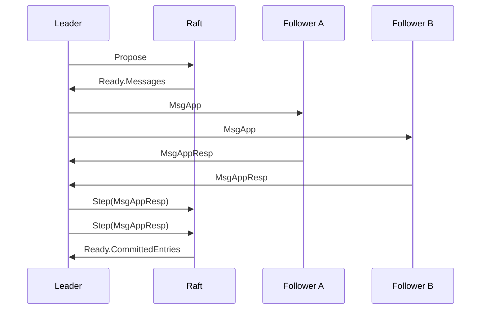

# 036g - The Response

We left 036 with one deliberate hole: the leader still has no honest reason to move commitIndex. After 036f, append causality is real, but commit causality is still fake.

036g makes that causal path honest: **a leader may commit an entry only after follower responses show quorum support, not because it appended locally.**

`Step` is the transition trigger, so the evidence must be collected after that transition happens. This means Raft itself must track quorum evidence inside the state machine. That is the seam 036g builds.

The bounded happy path looks like this:


036g therefore introduces `MsgAppResp`, so followers can reply to the leader. More precisely, follower `Step(MsgApp)` should expose `MsgAppResp` through `Ready.Messages`.

One design gap also appears here: once `Message` gets `To`, where does leader `Propose` get the target follower IDs? It should not come from the client-facing `Propose(data)` call. `Propose` carries client intent, not routing detail. So 036g also needs the smallest honest peer shape inside `Raft` itself: the leader knows its own ID and the follower IDs it should replicate to, and `Propose` emits one `MsgApp` per follower.

That is why `peers` appears in this episode. It is not a full replication tracker yet. It is only the minimum routing shape needed so leader-side replication work can stay inside Raft instead of leaking target selection into the caller.

When the leader receives a `MsgAppResp`, how does it advance quorum evidence? An integer is not enough. The leader must distinguish which entry is being acknowledged, and it must avoid counting the same responder twice. So 036g needs an entry identity plus responder identity.

The minimum honest shape is:
```go
const (
    ...
    MsgAppResp MessageType = 2
)

type Message struct {
    ...
    Index uint64
    Term  uint64
}

type entryID struct {
    index uint64
    term  uint64
}

type Raft struct {
    ...
    peers []uint64
    acks map[entryID]map[uint64]bool
}
```

Here, `peers` answers only one question: who should receive append messages from this leader? The richer per-peer state comes later, when different followers need different treatment.

This is also the right point to bring `From` and `To` in from `etcd`'s `Message` design:
 ```go
type Message struct {
    ...
    From  uint64
    To    uint64
    Index uint64
    Term  uint64
}
 ```

When does the tracker get created? At the place where the `Entry` is born. In 036g, that is `Propose`. The tracker gets updated when leader `Step(MsgAppResp)` runs.

That gives this bounded path:

- leader `Propose` creates one `Entry`
- leader seeds `acks[entryID]` with itself
- leader emits one `MsgApp` per follower using `peers`
- follower `Step(MsgApp)` exposes one `MsgAppResp`
- leader `Step(MsgAppResp)` records responder evidence
- once quorum is reached, leader advances `commitIndex`

036g stays bounded to one-entry append semantics. `Message` already carries `[]Entry` because the append path will later need one entry, many entries, and catch-up entries, but this episode only tracks quorum for the single entry created by `Propose`.

With that in place, leader `Step(MsgAppResp)` can finally move `commitIndex` for an honest reason: quorum evidence.

 ## Minimum tests
 
 #1 `TestTrackerCreatedOnPropose` proves a tracker exists after a new `Entry` is created.
 #2 `TestTrackerUpdatedOnStepMsgAppResp` proves follower evidence is recorded. For now, duplicate acks are harmless because the tracker shape is already idempotent.
 #3 `TestCommittedEntriesReadyAfterQuorumReached` proves the leader commits an entry only after quorum is reached.

 ## Bounded scope

 036g is complete when:
 - tracker is ready after leader `Propose`
 - leader emits one `MsgApp` per follower without widening `Propose(data)`
 - tracker gets updated when leader `Step(MsgAppResp)` runs
 - follower `Step(MsgApp)` exposes `MsgAppResp` through `Ready.Messages`
 - leader `Step(MsgAppResp)` exposes `Ready.CommittedEntries` when quorum is reached
 - tests pass