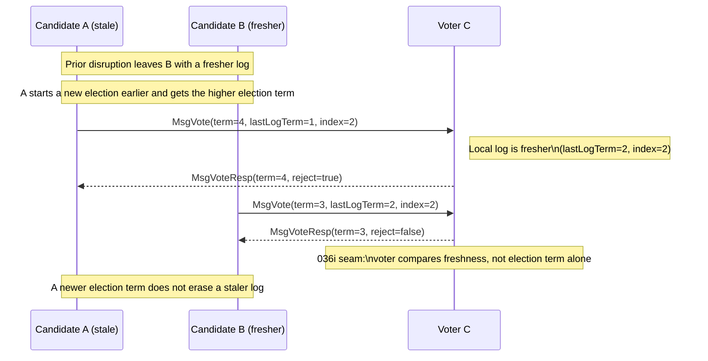

# 036i - The Freshness

We left log freshness and fuller term ownership open in [036h-the-election](036h-the-election.md), because they introduce a new truth that broadens 036h.

Consider a three-node cluster after disruption. Two nodes may start elections in nearby time windows. One of them may have a fresher log because it observed more of the previous leader’s history, while the other may simply start a new election earlier and therefore carry a higher election term. If votes were decided by election term alone, the earlier but staler candidate could collect votes and become leader, borrowing a newer term without owning the freshest known log.



This is a motivating race, not the full protocol surface implemented in 036i. 036i does not build that whole coordination race. It extracts only the voter-side freshness rule that prevents it.

That is the meaning of log freshness in this episode. We do not model the whole election race; we extract the local decision that blocks it. A voter must compare the candidate's last known log position with its own before granting a vote. That comparison requires `MsgVote` to carry the candidate's last log term and last log index, which also means `Campaign()` must emit vote requests with that local last-log evidence attached. Only then can the voter evaluate freshness through a small check such as `isCandidateUpToDate()`.

Let me shape the design:
```go
type Message struct {
    ...
    LogTerm uint64
}

func (r *Raft) Campaign() error {
    ...
    lastLog := r.lastLog()
    r.messages = append(r.messages, Message{
        Type:    MsgVote,
        From:    r.id,
        To:      pid,
        Term:    r.term,
        LogTerm: lastLog.Term,
        Index:   lastLog.Index,
    })
}

func (r *Raft) Step(m Message) error {
    switch m.Type {
    ...
    case MsgVote:
        rejected := m.Term < r.term ||
            (m.Term == r.term && r.votedFor != 0 && r.votedFor != m.From) ||
            !r.isCandidateUpToDate(m)
        ...
    }
}

func (r *Raft) isCandidateUpToDate(candidate Message) bool {
    lastLog := r.lastLog()
    if candidate.LogTerm != lastLog.Term {
        return candidate.LogTerm > lastLog.Term
    }
    return candidate.Index >= lastLog.Index
}
```

> `Raft.Term()` comes to mind here, but that is the **copy etcd shape trap** again. 036i has not earned a general term lookup. It needs only the voter's last log term and last log index, so the check stays local and minimal: read from the tail, prove freshness, and defer the broader API until a later invariant actually requires it.

*This is still a small step. It may even look like one election rule split into two smaller ones, so it is fair to worry that the steps are becoming too tiny. But the split earns itself here: majority-earned leadership and log freshness protect different failure modes. That is how this Raft path is being built — not as one large leap, but as a chain of small invariants we can prove with confidence. Without those solid steps, the Raft paper would remain only a paper. With them, the algorithm becomes something we can actually own.*

So 036i proves:

**A vote is granted only to a candidate whose log is at least as fresh as the voter's log.**

## Minimum tests

#1 `TestVoteRejectedWhenCandidateLastLogTermIsOlder_036i`
#2 `TestVoteRejectedWhenCandidateLastLogIndexIsLowerInSameLastTerm_036i`
#3 `TestCampaignIncludesLastLogPositionInVoteRequest_036i`

## Bounded scope

036i is complete when:
- `Campaign()` emits `MsgVote` carrying the candidate's last log term and last log index
- `Step(MsgVote)` exposes `MsgVoteResp` with `Reject=true` when the candidate's last log term is older than the voter's
- `Step(MsgVote)` exposes `MsgVoteResp` with `Reject=true` when the candidate's last log index is lower in the same last log term
- tests pass