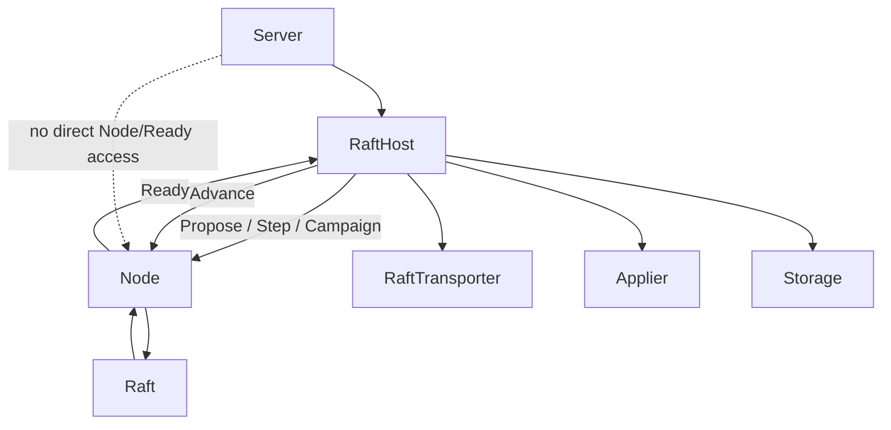

# 036m - The Raft Host

We left 036 after [036l-the-node-seam](036l-the-node-seam.md) with one critical boundary finally made explicit: the application/runtime talks to Raft only through `Node`, and Raft side effects leave only through `Ready`.

That makes the next step clear. The next honest layer is not the old write path. It is the Raft-native host/runtime layer above `Node` that owns the full `Node`/`Ready` lifecycle on behalf of the server.

In `kv-go`, that component should be named `RaftHost`.

After 036m, the server should no longer drive `Node` directly. `Ready` becomes internal to `RaftHost`.

## The problem

Right now pure `Raft` and the `Node` seam exist, but there is still no Raft-native runtime above them.

That means several facts are still missing from the architecture:

1. who owns peer identity for Raft nodes
2. how outbound `Ready.Messages` leave the process
3. how inbound Raft messages enter the runtime without the server reaching into `Node` directly
4. how the host persists, sends, applies, then calls `Advance()` as one runtime loop
5. how durable Raft state leaves the algorithm so the host can persist it

There is also one more ownership question that has to be answered explicitly:

6. how `RaftHost` is initialized with the peer set it is allowed to talk to

Without that layer, the system still does not have a real Raft communication substrate. It only has a pure state machine and a local host-facing seam.

If we jump straight to client writes here, we build application logic before the Raft runtime substrate is real. That would invert the architecture again.

## What real systems do

In an `etcd`-like architecture, Raft is not embedded into an old replication path. The runtime around it is rebuilt around Raft.

The host owns:

- peer identity
- persistence of `Ready.HardState`
- the transport seam
- persistence of `Ready.Entries`
- delivery of `Ready.Messages`
- application of `Ready.CommittedEntries`
- `Advance()` after that work is finished

In `etcd`, this responsibility is split across the Raft-driving runtime and the `apply` package. The important naming signal is that `etcd` talks about **apply** and **appliers**, not a generic `ApplyTarget` state-machine interface.

Pure Raft does not know sockets, addresses, or wire framing. But the host layer does.

That is why the host is the next upper layer after 036l.

## The decision

036m introduces one new architectural seam:

**The server talks to Raft only through `RaftHost`, and `RaftHost` owns the Raft-native runtime lifecycle keyed by Raft IDs, with ingress through `Node.Step()` and internal ownership of `Ready`.**

This is not the old `PeerManager` with a few patches. It is a new host/runtime component built around the Raft model. It should be constructed from a concrete peer list, but it should depend on injected seams for transport and apply rather than owning concrete socket details yet.

The host lifecycle should also be explicit. `NewRaftHost(...)` constructs the host, while the upper layer starts and stops it. That follows the `etcd` shape more closely than hiding startup inside the constructor.

There is one important precision here because `kv-go` already has a concrete `Node` seam. `Node` starts its own internal goroutine at construction time, so `RaftHost` must build that node on a host-owned context. Otherwise `RaftHost.Stop()` would only stop the outer coordinator loop and leak the node runtime underneath it. In this slice, explicit lifecycle ownership therefore means:

- the upper layer owns `RaftHost.Start()` and `RaftHost.Stop()`
- `RaftHost` owns the context that both its own loop and the constructed `Node` runtime live on
- stopping the host must cancel the whole Raft runtime owned by that host instance

That stop should be treated as terminal for the host instance. A stopped `RaftHost` is not restarted in place; recovery belongs above it by constructing a fresh host/runtime stack.

## Peer ownership and transport seam

`RaftHost` should speak the same identity language as Raft.

That means:

- Raft node IDs stay `uint64`
- peer lookup in the host layer is keyed by `uint64`
- transport ownership is organized around Raft nodes, not around old server identity artifacts

If useful code can be salvaged from `PeerManager`, that is fine. But the architectural seam should converge toward Raft-native identity instead of preserving a permanent mismatch.

`RaftHost` should start from a concrete peer list:

```go
type Peer struct {
	ID   uint64
}

type RaftHostConfig struct {
	ID        uint64
	Peers     []Peer
	Storage   raft.Storage
	Transport RaftTransporter
	Applier   Applier
}
```

That is better than a peer interface at this stage. The host already knows the concrete facts it needs: who the peer is and where it lives.

The abstraction should appear one level lower, around transport rather than peer identity.

A small Raft-specific transport seam is enough for 036m:

```go
type RaftTransporter interface {
	Send(msgs []raft.Message)
}
```

The transport should accept Raft messages in batch form. Each message already carries its own `To` field, so a separate destination parameter would duplicate routing information and create two sources of truth. This also stays closer to `etcd`, where the runtime hands one outbound `Ready.Messages` batch to transport.

The seam also should not return a send error in 036m. That is a deliberate ownership choice: once `RaftHost` hands the outbound batch to the transporter, delivery responsibility belongs to the transport subsystem rather than to the coordinator loop.

`RaftHost` also needs an apply seam because it claims ownership of committed-entry visibility. Following `etcd`'s naming, this should be expressed as an `Applier` concept rather than as a generic target:

```go
type Applier interface {
	Apply(entries []raft.Entry) error
}
```

`Peer` should remain identity/address data only. It should not carry transport objects.

Inbound messages can still enter through `RaftHost.Step()` in this slice. That keeps the host real without forcing concrete network receive loops and wire framing into the same episode.

One lower-layer prerequisite must now be stated explicitly. 036m does not sit cleanly above 036l unless the `Ready` contract is complete enough for the host loop to own persistence honestly. In practice that means `Ready` must carry `HardState`, and the Raft/Node layer must populate it whenever persistent Raft state changes. If that field exists structurally but no code path sets it yet, then 036m must force that lower-layer completion rather than inventing durable state inside `RaftHost`.

The clean ownership split is important here. Pure `Raft` should remain the source of truth for the current hard state, while the runtime seam above it owns the comparison against the last accepted batch. In other words:

- `Raft` exposes the current `HardState`
- `Node` decides whether that hard state is newly ready relative to the last accepted batch
- `Node` emits `Ready.HardState` only when the value changed

That is the same conceptual split `etcd` uses through `RawNode.prevHardSt`, just collapsed into the existing `Node` seam instead of introducing a separate wrapper type in this slice.

That also gives one precise meaning to an empty `Ready.HardState`: it means **no hard-state update in this batch**, not "persist zeroes". The host/storage path must therefore do two things correctly:

- persist hard-state-only batches even when there are no entries
- preserve the existing durable hard state when a batch carries entries but no new `HardState`

That prerequisite also needs direct unit tests. Otherwise 036m would be claiming a persistence contract that no code path proves.

So 036m should include:

- host-owned peer configuration keyed by Raft ID
- host-owned persistence of `Ready.HardState`
- outbound batched send through an injected `RaftTransporter`
- committed-entry visibility through an injected `Applier`
- inbound Raft messages entering through `RaftHost.Step()`

Concrete encoding/decoding and socket-level transport can remain behind that seam until the architecture actually needs to expose them. `RaftHost` itself should depend only on the `RaftTransporter` seam.

## Lifecycle and failure ownership

`RaftHost` is a long-lived coordinator, so its lifecycle should be explicit:

- `NewRaftHost(...)` constructs but does not start the host loop
- the upper layer calls `Start()`
- the upper layer can stop the host through `Stop()`
- `RaftHost` exposes terminal runtime failures through `Errors()`

`Stop()` should therefore be read as final shutdown for that host object, not as a pause/resume mechanism.

In the current `kv-go` shape, that should be read carefully. `Start()` controls the outer host loop that drains `Ready`, but `Stop()` must cancel the full host-owned runtime context so that the constructed `Node` also stops. Otherwise lifecycle ownership would be only partial and the host abstraction would leak.

If one `Ready` batch fails during persistence or apply, `RaftHost` should stop its own loop rather than attempting local recovery. Recovery policy belongs above the host. That keeps 036m bounded: the host owns coordination, while the server or a future supervisor decides whether to restart, step down, or terminate.

## Runtime loop ownership

`RaftHost` must own the full `Ready` contract:

1. drain `Ready`
2. persist `HardState` and unstable entries
3. send outbound messages as one batch through the injected transport
4. apply committed entries
5. call `Advance()`

That is the etcd-like runtime loop the architecture now needs. 036m does not need to solve all performance or concurrency questions. It only needs to make this host loop real.

The persistence detail needs to stay precise because this is where the lower seam leaked upward. The correct contract is:

- if a batch carries a non-empty `Ready.HardState`, the host must persist it even if there are no unstable entries
- if a batch carries entries but an empty `Ready.HardState`, that means "no hard-state update in this batch", not "persist zeroes"
- only after that persistence/apply/send work completes may the host call `Advance()`

The important boundary is that peer identity, transport delegation, apply delegation, and `Ready` handling now belong to `RaftHost`, while pure `Raft` and `Node` stay free of network details. If a small downward fix in `raft`/`node` is needed to make `Ready.HardState` real, that is not architectural backtracking. It is completing the lower contract that the upper host loop depends on.

Architecturally, this means:

- the server depends on `RaftHost`
- `RaftHost` depends on `Node`, `RaftTransporter`, `Storage`, and `Applier`
- `Node` depends on pure `Raft`
- the upper layer owns `RaftHost` startup, shutdown, and failure reaction

The flow is therefore:

- proposals or inbound Raft messages reach `RaftHost`
- `RaftHost` drives `Node`
- `Node` exposes `Ready`
- `RaftHost` persists, sends, applies, and advances
- if a batch fails, `RaftHost` reports the error and stops

That is the stack shape 036m exists to establish.



## What 036m proves

036m proves one invariant only:

**The server no longer drives Raft directly. `RaftHost` becomes the only component that owns the `Node`/`Ready` lifecycle and Raft peer communication above pure `Raft`.**

That is the first true upper layer once Raft becomes the center.

## Host-level tests

#1 `TestInternalRaftHostRequiresDependencies_036m`
The internal host constructor rejects missing runtime dependencies instead of silently creating a broken host.

#2 `TestNewRaftHostRequiresDependencies_036m`
The public host constructor rejects missing runtime dependencies before trying to build the runtime around them.

#3 `TestRaftHostConfigOwnsPeerList_036m`
`RaftHost` starts from a concrete peer list supplied by host configuration rather than discovering peers through hidden mutation inside pure `Raft`.

#4 `TestHostProposeFeedsProposalIntoNode_036m`
Client proposals reach the Raft algorithm only through `RaftHost.Propose()` and then `Node.Propose()`.

#5 `TestHostSendsReadyMessagesByRaftID_036m`
Outbound Raft messages are sent by the host in a Raft-native batch, using the message `To` fields rather than the old server replication path.

#6 `TestHostStepFeedsInboundRaftMessageIntoNode_036m`
An inbound Raft message enters the algorithm only through `RaftHost.Step()` and `Node.Step()`, not by reaching into pure `Raft` directly.

#7 `TestHostCampaignFeedsNodeCampaign_036m`
Election startup enters the algorithm only through `RaftHost.Campaign()` and then `Node.Campaign()`.

#8 `TestHostDrainsReadyThenAdvance_036m`
The host persists `Ready.HardState` and `Ready.Entries`, sends outbound messages, applies committed entries, and only then calls `Advance()`.

#9 `TestHostReportsBatchFailureAndStops_036m`
If batch handling fails, `RaftHost` reports the failure through `Errors()` and stops instead of attempting recovery internally.

#10 `TestHostPersistsHardStateOnlyBatch_036m`
A `Ready` batch that carries only `HardState` still crosses the persistence seam and is not skipped just because there are no unstable entries.

#11 `TestStoppedRaftHostDoesNotRestart_036m`
Once a host has been stopped, calling `Start()` again does not revive a canceled runtime in place. Restart, if needed, happens by constructing a fresh host.

## Required lower-seam support tests

These are not host tests, but 036m depends on them being true below the host. This list is the **minimum contract-critical set** for the host layer, not an exhaustive inventory of every related raft test:

- `TestReadyExposesHardStateAfterCampaign_036m`
- `TestReadyExposesHardStateAfterGrantingVote_036m`
- `TestReadyExposesHardStateAfterCommit_036m`
- `TestNodeReadyCarriesHardStateFromRaft_036m`
- `TestNodeReadyCarriesHardStateWithoutMessagesOrEntries_036m`
- `TestSaveWithEmptyHardStatePreservesExistingHardState_036m`

Without those tests, `RaftHost` would be built on an unproved assumption about `Ready.HardState`.

The raft package may still keep a few extra implementation-guard tests around this area. Those are useful, but they are not all part of the host-level completion contract. The important boundary for 036m is that the host can trust `Ready.HardState` semantics across:

- election state changes
- granted-vote persistence
- commit-index persistence
- hard-state-only readiness
- preservation of durable hard state when a batch carries entries but no new hard-state update

## Bounded scope

036m is complete when:
- there is a `RaftHost` component above `Node`
- `RaftHost` is keyed by Raft `uint64` node IDs
- `RaftHost` has explicit `Start()` / `Stop()` lifecycle owned by the upper layer
- `RaftHost.Stop()` cancels the full host-owned runtime, including the constructed `Node`
- `RaftHost.Stop()` is terminal for that host instance; restart requires constructing a fresh host
- `RaftHost` exposes terminal runtime failure through `Errors()`
- `Ready` exposes durable Raft state through `HardState`
- the Raft/Node layer actually populates `Ready.HardState` when persistent state changes
- outbound `Ready.Messages` leave through `RaftHost`
- outbound `Ready.Messages` are handed to transport as a batch rather than one call per destination argument
- inbound Raft messages enter through `RaftHost.Step()` and then `Node.Step()`
- outbound message delivery goes through an injected `RaftTransporter`
- committed-entry visibility goes through an injected `Applier`
- the host drains `Ready`, persists durable state, handles its work, and only then calls `Advance()`
- `RaftHost` is initialized from a concrete peer list keyed by Raft IDs
- the server no longer depends on `Node.Ready()` directly
- tests pass

036m does not need to:
- replace the KV write path yet
- implement follower progress tracking yet
- implement concrete wire encoding/decoding yet
- implement restart or recovery supervision yet
- solve membership changes
- preserve `PeerManager` as the architectural center
