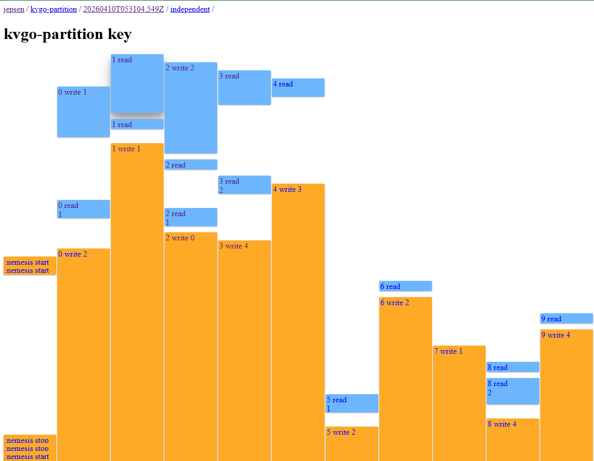
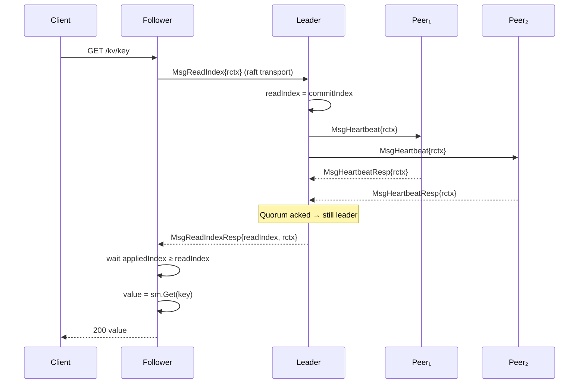

# 037l — The ReadIndex

037k's Jepsen partition test caught a stale read:



Time flows downward. Blue boxes are successful operations; orange boxes are writes that timed out. At the top, `0 write 1` and `2 write 2` both complete (blue). Then `1 write 1` begins — it stretches into a tall orange block, stuck waiting for a quorum that will never come. Around the same time, `0 read 1` returns (blue) with value `1`. But `2 write 2` already committed — the value should be `2`. On a different worker, `3 read 2` returns the correct value at roughly the same moment. Two concurrent reads, two different answers. The checker flags it: `{:valid? false}`.

Without partitions, the basic test also failed — two followers with different apply positions returned incompatible values to concurrent readers. Both failures have the same root cause: `httpGet` reads from the local state machine with no authority check.

## Reasoning

### Reads bypass Raft

Every write goes through Raft — propose, replicate, commit, apply. Every read goes straight to `s.sm.Get()`. That asymmetry is the root cause. The state machine on any given node might be behind (apply lag) or stale (partitioned leader). Reads must go through Raft too — but how?

### Naive fixes, and why they fail

**"Just read from the leader."** The leader's state machine is the most up to date, but how does the leader know it's still the leader? A partitioned leader still has `state = Leader`. Without a liveness check, leader-local reads are unsafe — the Raft paper calls this out explicitly (§8).

**"Check `state == Leader` before reading."** Same problem. State is local; it doesn't prove the network agrees. A leader that can't reach a majority might have been deposed by a higher-term election it hasn't heard about yet.

**"Commit a no-op entry before reading."** Correct but expensive — every read becomes a write to the Raft log, with the full propose-commit-apply latency. Read-heavy workloads pay write latency on every operation.

The no-op approach works because it forces a quorum round-trip — the leader can only commit if a majority acknowledges. That's the real mechanism: proving the leader is still in charge. The no-op is just an expensive way to get that proof. Can we get the proof without the log write?

### ReadIndex: heartbeat as proof of leadership

etcd's answer: send a heartbeat and wait for a majority to respond. No log entry, no fsync — just a network round-trip.

That round-trip costs ~1 RTT per read. Can we avoid it entirely? There are only two ways to prove you're still the leader: ask the cluster (consensus) or trust the clock (time). ReadIndex asks the cluster. The alternative — etcd calls it LeaseRead — trusts the clock: if the leader's lease hasn't expired, no election could have started, so the leader is safe to read locally without a heartbeat. Faster, but the safety proof shifts from "a majority confirmed me" to "my clock says I'm still within the lease." That's a different kind of guarantee. Bounded clock drift is the assumption — if clocks drift beyond the bound, a deposed leader could serve stale reads without knowing it. In Docker containers, we can't make that assumption. Cut it. But the fork is worth remembering: consensus vs clocks is a fundamental boundary in distributed systems. Spanner chose clocks (TrueTime). We chose consensus.



The leader records `commitIndex` as the read snapshot point, broadcasts a heartbeat with a correlation context, and waits for a majority to ack. If quorum responds, no new election could have completed in this term — an election also requires a majority, the two majorities must intersect, and the intersection node already voted for the current leader and won't grant a second vote. The leader is still in charge. It reads from its state machine and returns the value.

The leader may have multiple ReadIndex requests in flight concurrently. The heartbeat context correlates each heartbeat round to a specific read request, so acks are counted against the right one. Without it, a stale heartbeat response could falsely satisfy a newer read.

Followers don't read locally. A follower that receives a GET calls `proposeRead`, which steps `MsgReadIndex` into the local raft instance. The follower's `stepFollower` forwards it to the leader via raft transport — the same pattern as `MsgProp` forwarding for writes. The leader runs the full ReadIndex protocol and sends `MsgReadIndexResp` back. The follower receives `ReadState` in its own `Ready`, waits for its local apply loop to catch up, then reads from its own state machine.

A single-node cluster skips the heartbeat — it is trivially the majority.

This solves the partition failure. But it's worth pausing to notice what ReadIndex actually guarantees and what it doesn't. ReadIndex prevents the leader from *serving* stale data — if it can't prove quorum, the read fails. But it doesn't prevent a stale leader from *existing*. A partitioned leader that can't reach quorum just hangs, waiting for acks that never come. ReadIndex will time out each read, but the leader itself lingers in the leader state indefinitely. CheckQuorum is the complementary mechanism: the leader steps down proactively if it hasn't heard from a majority within an election timeout. CheckQuorum bounds how long a stale leader exists; ReadIndex prevents it from serving during that window. They solve different halves of the problem. But CheckQuorum is a separate mechanism with its own edge cases — preemptive step-down interacts with leader transfer, prevote, and network flaps. Cut it for this episode.

ReadIndex solves both failures — once every read goes through ReadIndex, no node serves `sm.Get()` without proof of leadership and a confirmed `commitIndex`. But implementing it creates a new question: the leader returns `readIndex = commitIndex`, and the reading node must wait until its state machine has applied all entries up through that index. How does it wait?

### The apply-lag gap

ReadIndex gives us a `readIndex` — the commitIndex at the moment the leader proved it was still in charge. The read is safe once the state machine has applied all entries up through `readIndex`. But whose applied index do we check?

Raft's internal `appliedIndex` advances on `Advance()` — before the server has actually applied entries to the state machine. If `proposeRead` checks raft's `appliedIndex`, it can pass too early: the entry is "applied" from raft's perspective but `s.sm.Put()` hasn't run yet. Reading `s.sm.Get()` at that point returns stale data.

We need a separate server-side `appliedIndex` that advances only after `s.sm.Put()` completes. The read path becomes:

```
GET /kv/{key}
  → s.proposeRead(ctx)        // blocks until ReadIndex confirms leader authority
  → val := s.sm.Get(key)      // safe: appliedIndex >= readIndex
  → return val
```

But that creates the next question: how does `proposeRead` wait for the apply loop to reach a specific index?

### Waiting for the apply loop

**Attempt 1: polling.** `proposeRead` spins on `s.appliedIndex.Load() >= readIndex`. Wastes CPU. Under light load, the apply loop might be idle for milliseconds between batches — polling burns cycles waiting for nothing.

**Attempt 2: condition variable.** The apply loop signals a `sync.Cond` after each batch. All readers wake up, check `appliedIndex`, and either proceed or go back to sleep. Better than polling, but every reader wakes on every apply — even readers waiting on index 1000 wake up when index 5 is applied. Thundering herd.

**Attempt 3: per-request channel.** Give each `proposeRead` caller its own channel. The apply loop iterates all pending channels after each batch and closes the ones whose target index has been reached. This works, but the apply loop touches every pending reader on every batch — O(n) per batch for n concurrent readers.

None of these are satisfying. etcd solves this with a data structure in `pkg/wait` called `WaitTime`. The insight: don't key on individual requests — key on the index itself.

### WaitTime: etcd's per-index channel map

`WaitTime` (from etcd's `pkg/wait/wait_time.go`) is a `map[uint64]chan struct{}`. The key is a logical deadline — in our case, a raft index. The value is a channel shared by all readers waiting on that index.

`Wait(index)` returns a channel:
- If the apply loop already passed this index (`lastTriggerDeadline >= index`), return an already-closed channel — the reader proceeds immediately, no allocation.
- Otherwise, look up or create a channel for this index. Multiple concurrent readers waiting on the same index share one channel.

`Trigger(index)` is called by the apply loop after each batch:
- Store `index` as `lastTriggerDeadline` (fast-path for future `Wait` calls).
- Iterate the map. For every entry where `key <= index`, close the channel and delete the entry.

The elegance: only the satisfied readers are woken — no thundering herd. `Trigger` does iterate the full map to find entries where `key <= index`, so the iteration cost is O(n) in the number of pending entries. But each satisfied entry is deleted, so the map stays small in practice. And `Wait` callers that arrive after the apply loop has already passed their index get an instant response with no map insertion at all.

```
Reader A: Wait(3)  → gets ch_3
Reader B: Wait(5)  → gets ch_5
Reader C: Wait(3)  → gets ch_3 (shared with Reader A)

Apply loop: Trigger(4)
  → close(ch_3): Reader A and Reader C unblock
  → ch_5 stays open: Reader B keeps waiting

Apply loop: Trigger(6)
  → close(ch_5): Reader B unblocks
```

ReadIndex plus the apply watermark solves both the partition failure and the apply-lag failure. The entire mechanism depends on one value: `commitIndex`. ReadIndex records it as the snapshot point. The apply watermark waits until the state machine reaches it. But what if `commitIndex` itself is wrong?

### The stale commitIndex problem

A freshly elected leader's `commitIndex` may lag behind the true commit point. The previous leader could have committed entries, crashed before broadcasting `leaderCommit` to anyone, and left every survivor with a stale view. The new leader has the entries in its log — Election Safety guarantees that — but it doesn't know they're committed.

Raft's commit rule makes this worse: a leader can only commit entries from its own term (§5.4.2). Previous-term entries are committed indirectly, as a side effect of committing a current-term entry at a higher index. Until that happens, `commitIndex` is stuck at its pre-election value.

ReadIndex trusts `commitIndex` as the read snapshot point. If `commitIndex` is stale, the read misses committed writes:

```
Term 1, Leader = S1:
  S1 replicates index 2 to {S1, S2, S3} → majority → S1 commits (commitIndex=2)
  S1 crashes before broadcasting leaderCommit=2 to anyone

  After crash:
  S1: log=[1,2]  commitIndex=2  (dead)
  S2: log=[1,2]  commitIndex=1  (has the entry, doesn't know it's committed)
  S3: log=[1,2]  commitIndex=1  (same)
  S4: log=[1]    commitIndex=1
  S5: log=[1]    commitIndex=1

  Election freshness = last log entry (term, index). commitIndex plays no role.
  S2 and S3 both have log=[1,2] — either can win. Say S2 wins.

Term 2, Leader = S2:
  S2.commitIndex = 1  ← stale! entry 2 was committed in term 1

  ┌─ NAIVE: ReadIndex uses commitIndex directly ────────────┐
  │ ReadIndex arrives at S2                                   │
  │ S2 records readIndex = commitIndex = 1                    │
  │ S2 broadcasts heartbeat → S3, S4 ack → quorum ✓          │
  │ S2 reads state machine at index 1                         │
  │ → STALE: misses the write at index 2 that already         │
  │   committed in term 1                                     │
  └───────────────────────────────────────────────────────────┘

  ┌─ FIX: defer ReadIndex until a current-term entry commits ┐
  │ ReadIndex arrives at S2                                   │
  │ S2 hasn't committed anything in term 2 yet                │
  │ → queue into pendingReadIndexMessages                     │
  │                                                           │
  │ S2 appends no-op at index 3 (term 2)                      │
  │ S2 replicates to S3, S4, S5 → majority has index 3       │
  │ S2 commits → commitIndex = 3                              │
  │                                                           │
  │ S2 drains pendingReadIndexMessages                        │
  │ readIndex = commitIndex = 3                               │
  │ S2 reads state machine at index 3                         │
  │ → CORRECT: includes the term-1 write at index 2           │
  └───────────────────────────────────────────────────────────┘
```

The no-op is the fix. It's a current-term entry, so Raft's commit rule applies. Committing it at index 3 forces `commitIndex` to advance past all previous-term entries — including index 2 that was already committed but unknown. After that, `commitIndex` reflects reality, and ReadIndex is safe.

The guard: if the leader hasn't committed an entry in its own term yet, queue `MsgReadIndex` requests into `pendingReadIndexMessages`. After the no-op commits, drain the queue and process each pending ReadIndex normally.

But the guard depends on a precondition: the leader must not advance `commitIndex` on previous-term entries alone. Our current commit path — `getMedian()` + `CommitTo(median)` — has no term check:

```
Term 2, Leader = S2:
  log = [1(t1), 2(t1), no-op@3(t2)]   commitIndex=1
  S3: matchIndex=0    S4: matchIndex=0

  S3 acks index 2 (a term-1 entry):
    matches = [3(self), 2(S3), 0(S4)]  →  median = 2

  ┌─ WITHOUT term check (current code) ─────────────────────┐
  │ CommitTo(2) → commitIndex = 2                            │
  │ entry 2 is term 1, not term 2                             │
  │ committedEntryInCurrentTerm() → false (no term-2 entry    │
  │ in [1..2]), but commitIndex already advanced.              │
  │ A second MsgAppResp that bumps median to 3:               │
  │ CommitTo(3) → commitIndex = 3                             │
  │ committedEntryInCurrentTerm() → true                      │
  │ pendingReadIndexMessages drains — but the drain could      │
  │ have fired at commitIndex = 2 if the check raced.          │
  │ → Fragile: correctness depends on ack ordering.           │
  └──────────────────────────────────────────────────────────┘

  ┌─ WITH term check (maybeCommit) ──────────────────────────┐
  │ termAt(2) = term 1 ≠ r.term (2) → skip commit           │
  │ commitIndex stays at 1                                    │
  │                                                           │
  │ Later: S3, S4 ack index 3 (term-2 no-op)                 │
  │ median = 3, termAt(3) = term 2 = r.term → commit         │
  │ commitIndex jumps 1 → 3, carrying index 2 with it        │
  │ committedEntryInCurrentTerm() → true                      │
  │ pendingReadIndexMessages drains with commitIndex = 3      │
  │ → ReadIndex returns 3. Correct.                           │
  └──────────────────────────────────────────────────────────┘
```

This is §5.4.2: a leader must not commit previous-term entries directly. They commit indirectly when a current-term entry at a higher index commits. etcd calls the guarded commit path `maybeCommit`.

### Where does termAt come from?

`maybeCommit` needs the term at a specific index — `termAt(median)` — to decide whether the median entry is from the current term. `committedEntryInCurrentTerm()` needs the same lookup to scan entries above `commitIndex` for any term-`r.term` entry.

Today the in-memory `r.log` slice carries `(index, term)` for every uncommitted entry, and `sendAppend` already scans it linearly to recover `prevTerm`. That works as long as the index lives inside the in-memory window. The window is fuzzy at both ends: the snapshot's `LastIncludedTerm` is the term for `LastIncludedIndex` but lives outside `r.log`, and after restart `r.log` is rebuilt from Storage rather than carried across the crash. Every caller that needs a term has to remember to fall back to the snapshot — `sendAppend` already does this by hand.

The `(index → term)` mapping is authoritative on Storage: the in-memory log, the WAL, and the snapshot boundary all sit behind it. The lookup belongs there, not duplicated at every call site. The Storage interface gains one method:

```
Term(i uint64) (uint64, error)
  i == snap.LastIncludedIndex → snap.LastIncludedTerm
  i in log entries            → entry.Term
  i  < snap.LastIncludedIndex → ErrCompacted
  i  > LastIndex()            → ErrUnavailable
```

`maybeCommit` and `committedEntryInCurrentTerm` call `storage.Term(i)`. `sendAppend`'s manual log-scan-then-snapshot-fallback collapses into the same call.

## Spec

### Protobuf

Add to the `MessageType` enum:

```protobuf
MsgReadIndex     = 11;
MsgReadIndexResp = 12;
```

Add `Context` field to `Message` (bytes). Carries a unique request ID (8 random bytes) that correlates a heartbeat broadcast with its originating ReadIndex request. The server generates the ID and passes it through `raftHost.ReadIndex(ctx, rctx)`. The raft layer stores the ID in `readOnly` when it starts the heartbeat round; peers echo it back in `MsgHeartbeatResp`; the leader matches responses to the right pending read.

### readOnly

```go
type readIndexStatus struct {
    req   *raftpb.Message        // original MsgReadIndex
    index uint64                 // commitIndex at time of request
    acks  map[uint64]bool        // which nodes have acked
}

type readOnly struct {
    pendingReadIndex map[string]*readIndexStatus  // key = string(rctx)
    readIndexQueue   []string                      // insertion-ordered queue (map is unordered)
}
```

The map key is `string(rctx)`, not `[]byte` — Go maps require comparable keys, and slices aren't comparable. `string(rctx)` is a lossless conversion; every byte sequence is a valid Go string. Language constraint, not a design choice.

`addRequest(index, m)` stores the committed index and original message, keyed by `string(m.Context)`. Appends `string(m.Context)` to `readIndexQueue`.

`recvAck(id, context)` records that node `id` acked the heartbeat for `context`. Returns the ack count for quorum checking.

`advance(m)` is called when a request reaches quorum. It drains `readIndexQueue` up to and including `string(m.Context)`, deleting each from `pendingReadIndex` and returning all drained requests. A later quorum proof subsumes all earlier ones — leadership is monotonic within a term.

### Storage

Add to the `Storage` interface:

```go
Term(i uint64) (uint64, error)
```

Add `ErrUnavailable = errors.New("requested index is unavailable")` alongside `ErrCompacted`.

`DurableStorage.Term` resolves in this order: snapshot boundary → in-memory entries slice → error. The two test fakes (`raft/raft_test.go`, `server/test_mocks.go`) implement the same resolution against their own backing slice.

### Raft-level wiring

`Node.ReadIndex(ctx context.Context, rctx []byte) error` — async, like `Propose`. Steps `MsgReadIndex{Context: rctx}` into raft.

`maybeCommit`: replaces the leader's raw `getMedian` + `CommitTo` in the `MsgAppResp` handler. Computes the median match index; if `termAt(median) == r.term`, commits. Otherwise does nothing — previous-term entries wait for a current-term entry to carry them.

**No-op entry**: `becomeLeader()` self-steps an empty `MsgProp` (entry with `Data: nil`). This guarantees a current-term entry exists in the log immediately after election. Once replicated and committed via `maybeCommit`, it advances `commitIndex` past all previous-term entries and makes `committedEntryInCurrentTerm()` return true — unblocking any queued ReadIndex requests.

Server-side handling: the apply loop receives the no-op as a committed entry with empty data. `applyEntry` detects `len(raw) == 0` and skips it — no `unmarshalEnvelope`, no `s.w.Trigger`, no `sm.Put`.

`stepLeader` handles `MsgReadIndex`:

1. If singleton cluster — append `ReadState{Index: commitIndex, RequestCtx: rctx}` to `r.readStates` immediately. No heartbeat needed.
2. If `committedEntryInCurrentTerm()` is false — the leader hasn't committed a current-term entry yet, so `commitIndex` may be stale. Append the message to `r.pendingReadIndexMessages`. Return.
3. Otherwise — call `readOnly.addRequest(commitIndex, m)`, self-ack via `readOnly.recvAck(r.id, rctx)`, broadcast `MsgHeartbeat` with `Context: rctx` to all peers.

`stepLeader` handles `MsgHeartbeatResp` (when `len(m.Context) > 0`):

1. Call `readOnly.recvAck(m.From, m.Context)`.
2. Check quorum. If not reached, return.
3. Call `readOnly.advance(m)` — returns all drained requests.
4. For each drained request: if the original `MsgReadIndex` came from this node, append `ReadState{Index, RequestCtx}` to `r.readStates`. If it came from a follower, send `MsgReadIndexResp` back.

`stepFollower` handles `MsgReadIndex`: if `r.lead == None`, return `ErrProposalDropped` — no leader to forward to, fail fast rather than blocking the caller until ctx deadline. Otherwise set `m.To = r.lead` and call `r.send(m)` (which preserves `m.From` so the leader knows where to send `MsgReadIndexResp` back). Same pattern as `MsgProp` forwarding.

`stepCandidate` handles `MsgReadIndex`: return `ErrProposalDropped`. Candidates have no committed-term entry and no leader to forward to.

`stepFollower` handles `MsgReadIndexResp`: appends `ReadState{Index: m.Index, RequestCtx: m.Context}` to `r.readStates`. The follower's `Ready` delivers it to the server, which triggers `s.w` and waits on `s.applyWait` before reading from the local state machine.

`committedEntryInCurrentTerm` guard: when the no-op commits and `commitIndex` advances, `maybeCommit` calls `releasePendingReadIndexMessages` to re-step each queued `MsgReadIndex` through `stepLeader`. They now pass the guard and enter `readOnly` normally.

`Ready` includes `ReadStates []ReadState`. `ReadState` carries `Index` (the confirmed `commitIndex`) and `RequestCtx` (the correlation ID). Cleared on `Advance()`.

### WaitTime

```go
type WaitTime struct {
    mu                  sync.Mutex
    lastTriggerDeadline uint64
    m                   map[uint64]chan struct{}
}
```

`Wait(index)` returns a channel. If `lastTriggerDeadline >= index`, return an already-closed channel (no allocation). Otherwise, look up or create a channel for this index — concurrent readers share it.

`Trigger(index)` is called by the apply loop. Store `index` as `lastTriggerDeadline`. Iterate the map; for every entry where `key <= index`, close the channel and delete the entry.

### Server read path

`proposeRead(ctx)` generates an 8-byte `rctx`, registers on `s.w` (same `wait.Wait` as writes), calls `raftHost.ReadIndex(ctx, rctx)` (async), blocks on `s.w` for the matching `ReadState`, then on `s.applyWait.Wait(readIndex)` until the state machine catches up.

`RaftHost` exposes `ReadState() <-chan raft.ReadState`, backed by a size-1 buffered channel on `raftHost` — mirrors `applyc`, one slot of slack for the Ready loop. `handleBatch` iterates `rd.ReadStates` and sends each element, blocking on `stopc` during shutdown. A wedged consumer will back-pressure raft (same shared risk as `applyc`); not specific to ReadState. Every ReadState is forwarded; without batching (open thread #3), each `rctx` has its own waiter.

The server's `run()` loop adds a case: `rs := <-s.raftHost.ReadState()` → `s.w.Trigger(binary.BigEndian.Uint64(rs.RequestCtx), rs.Index)`. Independent of the apply stream.

## Minimum tests

**Invariant:** every successful read returns a value consistent with the linearized order of all committed writes — no read can return a value that has been superseded by a committed write.

1. **Leader ReadIndex returns committed value (single reader)** — a leader with quorum serves one ReadIndex and returns the latest committed value, not a stale one. (Concurrent-reader correlation is #16.)
2. **Follower GET forwards to leader** — a follower proxies the read to the leader; no local state machine read occurs on the follower.
3. **Partitioned leader rejects ReadIndex** — a leader that cannot reach a majority returns an error, not stale data.
4. **Leader steps down mid-heartbeat** — a leader that loses authority during a pending ReadIndex never returns a stale value; caller unblocks with `ctx.Err()` at ctx deadline. (Clean `ErrLeaderChanged` on transition is open thread #5.)
5. **ReadIndex postponed until first commit in term** — a ReadIndex arriving before the leader's first commit is queued and processed after the no-op commits.
6. **Singleton cluster skips heartbeat** — a single-node cluster serves ReadIndex immediately without heartbeat broadcast.
7. **HTTP GET goes through ReadIndex** — `httpGet` calls `proposeRead` before `sm.Get()`. A GET during partition returns an error.
8. **proposeRead waits for apply loop** — a read does not execute `sm.Get()` until the apply loop has reached the read's target index.
9. **WaitTime fast path** — `Wait` on an index already passed by `Trigger` returns an immediately-closed channel.
10. **WaitTime partial trigger** — `Trigger(n)` closes channels at or below `n` and leaves higher-index channels open.
11. **Jepsen basic workload passes** — `lein run test -w basic` reports `{:valid? true}`. No apply-lag violations.
12. **Jepsen partition workload passes** — `lein run test -w partition` reports `{:valid? true}`. No stale reads during or after partition.
13. **maybeCommit skips previous-term median** — a leader with a majority-replicated previous-term entry does not advance `commitIndex`; it advances only after a current-term entry commits at a higher index.
14. **No-op committed on leader election** — a newly elected leader's first committed entry is an empty no-op; the apply loop skips it without triggering `s.w` or writing to the state machine.
15. **stepFollower/stepCandidate fast-fail on unknown leader** — a `MsgReadIndex` at a follower with `lead==None` or at a candidate returns `ErrProposalDropped` immediately, not a silent forward.
16. **Concurrent ReadIndex rctx correlation** — two in-flight requests produce two `ReadState`s whose `RequestCtx` values match the originating `rctx`; each routes to its own waiter.
17. **raftHost surfaces ReadStates** — `rd.ReadStates` from a `Ready` are forwarded element-by-element to `RaftHost.ReadState()`; the server's `run()` loop triggers `s.w` keyed by `binary.BigEndian.Uint64(rs.RequestCtx)`.

## Open threads

1. **LeaseRead** — clock-based read optimization; deferred because Docker clock drift makes the safety assumption unreliable.
2. **CheckQuorum** — leader step-down on lost majority; deferred because it interacts with leader transfer, prevote, and network flaps.
3. **Read batching** — etcd's `linearizableReadLoop` coalesces concurrent reads into a single ReadIndex round via a notifier-swap pattern. Without it, each `proposeRead` issues its own `MsgReadIndex` and heartbeat broadcast. Correct but wasteful under read-heavy load. Additive optimization — the raft layer and `readOnly` protocol are unchanged; only the server's call pattern above them changes.
4. **`peers` excludes self.** Every quorum site pays a `+1` tax (`(len(peers)+1)/2 + 1`), and `getMedian` / `becomeCandidate` prepend self manually. etcd's `trk.Progress` includes self so quorum math, self-ack, and self-vote flow through one uniform path. Flip when introducing `voters` for learners / conf-change — will delete more code than it adds.
5. **Leader-change notifier for mid-flight reads.** Today, a `MsgReadIndex` forwarded to a leader that steps down before quorum-acking leaves the caller blocked until its context deadline. The raft layer fast-fails only when the leader is already unknown at step time (`stepFollower`/`stepCandidate` return `ErrProposalDropped`). etcd bounds mid-flight loss with a server-side `leaderChangedNotifier` — a channel closed on every `lead` transition; `linearizableReadLoop` selects on it alongside `ctx.Done()` and returns `ErrLeaderChanged` immediately. Flip when Jepsen with a leader-kill nemesis shows P99 blowup during failover.