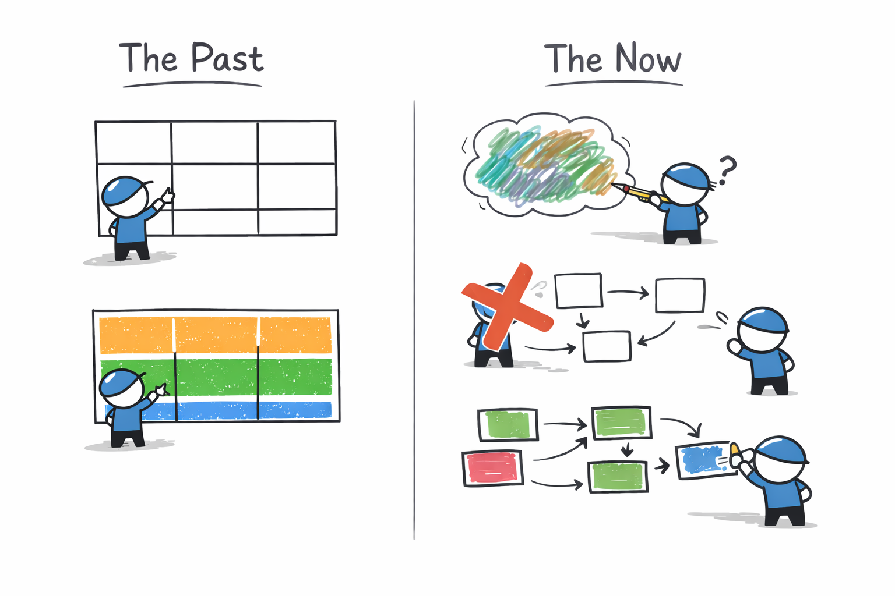

# Software Design Moves Top-Down, Bottom-Up, and Back Again

Before `kv-go`, I tended to think software design should happen mostly from the top down. First understand the architecture, then define the layers and interfaces, then start implementing. That sounds reasonable, but in practice I often got stuck when the design was still too far from reality.

The 036 series changed that feeling. In 036a, I made a very top-down decision: the log should move to the center, and the key-value engine should become a state machine driven by Raft. That decision mattered. Without it, there was no direction. It told me what kind of system `kv-go` wanted to become.

But top-down thinking alone was not enough to let me build. When I reached 036b, the design was still too large. I knew I wanted a pure Raft model, but I could not make progress because too many details were mixed together. It only started moving when I found one small seam: `Ready`. That was not the whole design. It was just one place where the top-down idea became concrete enough to test.

From there, bottom-up pressure started doing its job. `Advance` forced me to make the `Ready -> Advance` protocol precise. Storage forced me to separate durable state from volatile state. The apply loop forced me to distinguish committed entries from visible engine state. Later, wiring the model into the real server exposed ownership bugs that the clean design had hidden. Each implementation step pushed back on the earlier picture and either confirmed it or corrected it.

This is why I no longer think software design moves in one direction. Top-down design is necessary because it gives the system a shape. Without it, work fragments into local fixes. But bottom-up work is just as necessary because it exposes where the shape is still fake. If a boundary cannot survive a small implementation or a small unit test, then the design was not ready yet, no matter how elegant it looked on paper.

For me, the real workflow now looks more like a loop than a line. First make a top-down claim: define the subject, the boundary, or the invariant. Then build one small piece under that claim. Then let the code, tests, and failure modes push back. If the pressure reveals a mistake, revise the design and go again. Direction comes from the top. Resistance comes from the bottom. The shape becomes trustworthy only after they meet.

This changed my own process more than I expected. Before this project, I often treated design as something that should become clear before coding. `kv-go` taught me a different rhythm. Design does not disappear when coding starts, and coding is not just execution of a finished plan. Each side corrects the other. A clean top-down idea without bottom-up pressure is often just borrowed confidence. Bottom-up code without top-down direction easily becomes a pile of local solutions.

I am still learning this rhythm, and I still fall back into the old fantasy of wanting the whole design to feel complete first. But at least now I trust something more realistic. Good software design is not the ability to predict the whole system in advance. It is the ability to keep moving between direction and detail without losing the boundary.